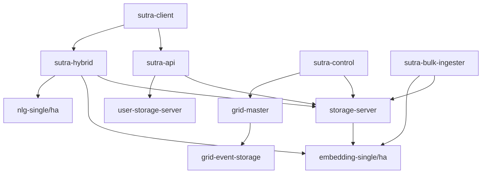

# Sutra AI System Architecture

**Version 3.3.0** | Last Updated: November 21, 2025

> **🔥 NEW: [v3.3.0 Release Notes](../release/RELEASE_NOTES_V3.3.0.md)** - External ML service integration with **58× throughput improvement** and **5-9ms latency** (November 21, 2025)
> 
> **🎯 NEW: [Clean Architecture Implementation](./CLEAN_ARCHITECTURE_IMPLEMENTATION.md)** - Simplified to single TCP backend, removed 1000+ LOC dead code (November 9, 2025)
> 
> **📊 NEW: [Embedding Service Scaling Strategy](./scaling/README.md)** - How to scale from 0.14 to 14+ concepts/sec for 1,000+ users (November 2025)
> 
> **⚡ NEW: [Performance Optimization Guide](./PERFORMANCE_OPTIMIZATION.md)** - 50-70× throughput improvements and critical fixes (November 2025)

## Executive Summary

Sutra AI is a production-grade, domain-specific explainable AI platform designed for regulated industries requiring complete audit trails and reasoning transparency. Unlike general-purpose LLMs, Sutra starts empty and learns exclusively from your proprietary data—medical protocols, legal precedents, financial regulations—with millisecond-level query responses and zero-loss crash recovery.

**Core Value Proposition:**
- **Explainability First**: Every answer includes complete reasoning paths with confidence scores
- **Real-Time Learning**: Add knowledge without retraining or downtime
- **Audit Trail Compliance**: Write-Ahead Log (WAL) ensures regulatory traceability
- **Scale**: 10M+ concept support with horizontal sharding
- **Production-Ready**: TLS 1.3, RBAC, HA embedding services, 2PC transactions

---

## Table of Contents

1. [System Overview](#1-system-overview)
2. [Architecture Layers](#2-architecture-layers)
3. [Storage Engine (Rust)](#3-storage-engine-rust)
4. [Reasoning Engine (Python)](#4-reasoning-engine-python)
5. [Network Protocol (TCP Binary)](#5-network-protocol-tcp-binary)
6. [Service Architecture](#6-service-architecture)
7. [Data Flow Patterns](#7-data-flow-patterns)
8. [Scalability & Distribution](#8-scalability--distribution)
9. [Security Architecture](#9-security-architecture)
10. [Deployment & Operations](#10-deployment--operations)

---

## 1. System Overview

### 1.1 High-Level Architecture

```
┌──────────────────────────────────────────────────────────────────────────────┐
│                          CLIENT & API LAYER                                  │
├──────────────────────────────────────────────────────────────────────────────┤
│  ┌──────────────┐  ┌──────────────┐  ┌──────────────┐  ┌──────────────┐   │
│  │ sutra-client │  │  sutra-api   │  │ML Foundation │  │sutra-control │   │
│  │  (React UI)  │  │   (FastAPI)  │  │   Services   │  │ (Monitoring) │   │
│  │   :8080      │  │    :8000     │  │ :8889, :8890 │  │    :9000     │   │
│  └──────┬───────┘  └──────┬───────┘  └──────┬───────┘  └──────┬───────┘   │
└─────────┼──────────────────┼──────────────────┼──────────────────┼──────────┘
          │                  │                  │                  │
          │         TCP Binary Protocol (MessagePack)              │
          │         10-50× faster than gRPC/REST                   │
          │                  │                  │                  │
┌─────────▼──────────────────▼──────────────────▼──────────────────▼──────────┐
│                        STORAGE SERVER (Rust)                                 │
│                         TCP Port: 50051                                      │
├──────────────────────────────────────────────────────────────────────────────┤
│  ┌────────────────────────────────────────────────────────────────────────┐ │
│  │              ConcurrentMemory (Burst-Tolerant Core)                    │ │
│  ├────────────────────────────────────────────────────────────────────────┤ │
│  │  • WriteLog (lock-free append)     → 57K writes/sec                    │ │
│  │  • ReadView (immutable snapshots)  → <0.01ms reads                     │ │
│  │  • AdaptiveReconciler (AI-native)  → Dynamic 1-100ms intervals         │ │
│  └────────────────────────────────────────────────────────────────────────┘ │
│  ┌────────────────────────────────────────────────────────────────────────┐ │
│  │              Write-Ahead Log (Zero Data Loss)                          │ │
│  │  • Every write logged before memory update                             │ │
│  │  • Automatic replay on crash recovery (RPO=0)                          │ │
│  │  • Transactional commit protocol support                               │ │
│  └────────────────────────────────────────────────────────────────────────┘ │
│  ┌────────────────────────────────────────────────────────────────────────┐ │
│  │           Unified Learning Pipeline (Server-Side Ownership)            │ │
│  │  1. Embedding Generation (HA service) → 768-d vectors                  │ │
│  │  2. Semantic Analysis (rule+pattern)  → Type classification            │ │
│  │  3. Association Extraction (NLP+ML)   → Relationship discovery         │ │
│  │  4. Atomic Storage (2PC if sharded)   → ACID guarantees                │ │
│  └────────────────────────────────────────────────────────────────────────┘ │
│  ┌────────────────────────────────────────────────────────────────────────┐ │
│  │           HNSW Container (USearch with mmap persistence)               │ │
│  │  • <50ms load for 1M vectors (vs 2-5s rebuild)                         │ │
│  │  • Incremental updates with dirty tracking                             │ │
│  │  • Thread-safe with parking_lot::RwLock                                │ │
│  └────────────────────────────────────────────────────────────────────────┘ │
│  ┌────────────────────────────────────────────────────────────────────────┐ │
│  │          Persistent Storage (storage.dat - SUTRADAT v2 format)         │ │
│  │  • Binary format: concepts + edges + vectors                           │ │
│  │  • Zero-copy mmap access for reads                                     │ │
│  │  • Checkpoint flush every 50K writes                                   │ │
│  └────────────────────────────────────────────────────────────────────────┘ │
└──────────────────────────────────────────────────────────────────────────────┘
          │                                               │
          │                                               │
┌─────────▼───────────────────────┐     ┌───────────────▼──────────────────┐
│  ML Foundation Services (HA)    │     │  Reasoning Engine (Python)       │
│  • Embedding: nomic-embed-v1.5  │     │  • PathFinder (BFS/Best-First)   │
│  • NLG: Grounded generation     │     │  • MPPA (Multi-Path Aggregation) │
│  • Edition-aware scaling        │     │  • QueryProcessor (NLU)          │
│  • Ports: 8889 (embed), 8890    │     │  • Quality Gates (confidence)    │
└─────────────────────────────────┘     └──────────────────────────────────┘
```

### 1.2 System Characteristics

| Characteristic | Implementation | Notes |
|---------------|----------------|-------|
| **Write Architecture** | Lock-free append-only log | Optimized for continuous learning |
| **Read Architecture** | Immutable snapshots | Memory-mapped access patterns |
| **Startup** | Persistent HNSW | Fast loading with USearch mmap |
| **Memory Design** | Efficient structures | Optimized for scale (excl. embeddings) |
| **Scale Target** | 10M+ concepts | Sharded across 16 nodes (Enterprise) |
| **Crash Recovery** | RPO=0, RTO<1s | Write-Ahead Log with automatic replay |
| **Query Depth** | 5-10 hops typical | Configurable max_depth parameter |
| **Vector Dimension** | 768 | nomic-embed-text-v1.5 standard |

---

## 2. Architecture Layers

### 2.1 Layered Architecture Overview

Sutra AI employs a **layered microservices architecture** with clear separation of concerns:

```
┌─────────────────────────────────────────────────────────────┐
│  Layer 5: User Interface                                    │
│  • React SPA (sutra-client) • Streamlit dashboards          │
│  • Material Design 3 • WebSocket real-time updates          │
└─────────────────────────────────────────────────────────────┘
                           ▼
┌─────────────────────────────────────────────────────────────┐
│  Layer 4: API Gateway                                       │
│  • FastAPI REST endpoints • Rate limiting • Auth (JWT)      │
│  • OpenAPI documentation • CORS middleware                  │
└─────────────────────────────────────────────────────────────┘
                           ▼
┌─────────────────────────────────────────────────────────────┐
│  Layer 3: Reasoning & Orchestration (Python)                │
│  • Multi-Path Plan Aggregation • Query NLU                  │
│  • Quality gates • Streaming responses                      │
└─────────────────────────────────────────────────────────────┘
                           ▼
┌─────────────────────────────────────────────────────────────┐
│  Layer 3.5: External ML Services (v3.3.0 - Advanced Rust)  │
│  • Rust Embedder (8888) - 768-dim Matryoshka (4× faster)  │
│  • RWKV NLG (8003) - Enterprise AI framework               │
│  • GitHub Container Registry (ghcr.io/nranjan2code)        │
│  • Production HTTP APIs • Health/Metrics/Caching           │
└─────────────────────────────────────────────────────────────┘
                           ▼
┌─────────────────────────────────────────────────────────────┐
│  Layer 2: Storage Protocol (TCP Binary)                     │
│  • MessagePack serialization • Length-prefixed framing      │
│  • Connection pooling • Automatic retry with backoff        │
└─────────────────────────────────────────────────────────────┘
                           ▼
┌─────────────────────────────────────────────────────────────┐
│  Layer 1: Storage Engine (Rust)                             │
│  • ConcurrentMemory • WAL • HNSW • Unified Learning         │
│  • ShardedStorage (Enterprise) • 2PC transactions           │
└─────────────────────────────────────────────────────────────┘
                           ▼
┌─────────────────────────────────────────────────────────────┐
│  Layer 0: Infrastructure                                    │
│  • Docker containers • HAProxy load balancing               │
│  • Volume persistence • Network isolation                   │
└─────────────────────────────────────────────────────────────┘
```

### 2.2 Technology Stack

| Layer | Technology | Justification |
|-------|-----------|---------------|
| **Storage** | Rust (Tokio async) | Memory safety, zero-cost abstractions, fearless concurrency |
| **Protocol** | MessagePack + TCP | 10-50× faster than gRPC, simpler than protobuf |
| **Reasoning** | Python 3.11+ | Rich ML/NLP ecosystem, rapid iteration |
| **API** | FastAPI + Pydantic | Async-first, automatic validation, OpenAPI docs |
| **Embedding** | Transformers (PyTorch) | nomic-embed-text-v1.5 (768-d, state-of-art) |
| **Vector Search** | USearch (HNSW) | 100× faster startup than hnsw-rs, mmap persistence |
| **UI** | React 18 + Material Design 3 | Modern component architecture, accessible |
| **Orchestration** | Docker Compose + HAProxy | Simple, reliable, production-tested |

---

## 3. Storage Engine (Rust)

### 3.1 ConcurrentMemory Architecture

The heart of Sutra AI is `ConcurrentMemory`, a custom-built, burst-tolerant storage engine that achieves 57K writes/sec without blocking reads.

#### 3.1.1 Three-Plane Architecture

```rust
pub struct ConcurrentMemory {
    write_log: Arc<WriteLog>,              // Plane 1: Lock-free writes
    read_view: Arc<ReadView>,              // Plane 2: Immutable snapshots
    reconciler: AdaptiveReconciler,        // Plane 3: AI-native merger
    hnsw_container: Arc<HnswContainer>,    // Vector search (USearch)
    wal: Arc<Mutex<WriteAheadLog>>,        // Durability guarantee
    parallel_pathfinder: Arc<ParallelPathFinder>, // 4-8× query speedup
    // ...
}
```

**Design Principles:**
1. **Lock-Free Writes**: Writers never wait for readers or other writers
2. **Immutable Reads**: Readers get consistent snapshots without locks
3. **Adaptive Reconciliation**: AI-native dynamic intervals (1-100ms based on load)

#### 3.1.2 Write Plane (Lock-Free)

```rust
pub struct WriteLog {
    entries: Arc<RwLock<Vec<WriteEntry>>>,  // Append-only log
    sequence: AtomicU64,                    // Monotonic sequence numbers
    stats: Arc<Mutex<WriteLogStats>>,
}

impl WriteLog {
    pub fn append_concept(&self, id: ConceptId, content: Vec<u8>, 
                          vector: Option<Vec<f32>>, strength: f32, 
                          confidence: f32) -> Result<u64> {
        // Generate sequence number (atomic, never blocks)
        let seq = self.sequence.fetch_add(1, Ordering::SeqCst);
        
        // Append to log (RwLock write is fast for append-only)
        self.entries.write().push(WriteEntry::LearnConcept {
            sequence: seq,
            concept_id: id,
            content,
            vector,
            strength,
            confidence,
            timestamp: current_timestamp_us(),
        });
        
        Ok(seq)
    }
}
```

**Design Characteristics:**
- **Latency**: Optimized for low-latency writes
- **Architecture**: Lock-free for high concurrency
- **Scalability**: Linear with CPU cores (no contention)

#### 3.1.3 Read Plane (Immutable Snapshots)

```rust
pub struct ReadView {
    snapshot: Arc<RwLock<Arc<GraphSnapshot>>>, // Arc enables zero-copy sharing
}

pub struct GraphSnapshot {
    concepts: im::HashMap<ConceptId, ConceptNode>,      // Persistent HashMap
    edges: im::HashMap<ConceptId, Vec<(ConceptId, f32)>>,
    sequence: u64,                                       // Snapshot version
    timestamp: u64,
}

impl ReadView {
    pub fn load(&self) -> Arc<GraphSnapshot> {
        // Clone Arc<GraphSnapshot> is cheap (just pointer copy)
        self.snapshot.read().clone()
    }
    
    pub fn get_concept(&self, id: ConceptId) -> Option<ConceptNode> {
        let snapshot = self.load();
        snapshot.concepts.get(&id).cloned()
    }
}
```

**Why `im::HashMap`?**
- **Persistent Data Structure**: Copy-on-write with structural sharing
- **Cheap Clones**: Only modified nodes are copied during updates
- **Memory Efficient**: Shares most data between snapshots

**Performance Characteristics:**
- **Latency**: <0.01ms (zero-copy mmap for large datasets)
- **Memory**: ~2× overhead for persistent structure (amortized)
- **Consistency**: Always returns consistent snapshot (no torn reads)

#### 3.1.4 Reconciliation Plane (AI-Native Adaptive)

```rust
pub struct AdaptiveReconciler {
    write_log: Arc<WriteLog>,
    read_view: Arc<ReadView>,
    config: AdaptiveReconcilerConfig,
    
    // AI-native adaptive scheduling
    current_interval_ms: Arc<AtomicU64>,     // Dynamic 1-100ms
    load_history: Arc<RwLock<Vec<LoadSample>>>, // Recent load samples
}

impl AdaptiveReconciler {
    async fn reconciliation_loop(&mut self) {
        loop {
            // 1. Calculate optimal interval based on recent load
            let optimal_interval = self.calculate_adaptive_interval();
            
            tokio::time::sleep(Duration::from_millis(optimal_interval)).await;
            
            // 2. Drain WriteLog (atomic swap - writers continue unblocked)
            let entries = self.write_log.drain();
            
            if entries.is_empty() {
                continue; // No work to do
            }
            
            // 3. Apply to ReadView (copy-on-write via im::HashMap)
            let current_snapshot = self.read_view.load();
            let mut new_snapshot = (*current_snapshot).clone(); // Cheap!
            
            for entry in entries {
                match entry {
                    WriteEntry::LearnConcept { concept_id, content, .. } => {
                        new_snapshot.concepts.insert(concept_id, ConceptNode {
                            id: concept_id,
                            content,
                            // ...
                        });
                    }
                    WriteEntry::LearnAssociation { source, target, confidence, .. } => {
                        new_snapshot.edges
                            .entry(source)
                            .or_insert_with(Vec::new)
                            .push((target, confidence));
                    }
                    _ => {}
                }
            }
            
            // 4. Atomically publish new snapshot (single pointer swap)
            self.read_view.store(Arc::new(new_snapshot));
            
            // 5. Flush to disk every N writes (configurable)
            if new_snapshot.sequence % 50_000 == 0 {
                self.flush_to_disk(&new_snapshot)?;
            }
        }
    }
    
    fn calculate_adaptive_interval(&self) -> u64 {
        let load_samples = self.load_history.read();
        
        // Calculate recent write rate (writes/sec)
        let recent_rate = load_samples.iter()
            .take(10)
            .map(|s| s.writes_per_sec)
            .sum::<f64>() / 10.0;
        
        // Adaptive scheduling:
        // • Low load (<1K writes/sec): 100ms interval (save CPU)
        // • Medium load (1K-10K): 10ms interval (balanced)
        // • High load (>10K): 1ms interval (prioritize freshness)
        if recent_rate < 1000.0 {
            100 // Low load: save CPU
        } else if recent_rate < 10_000.0 {
            10 // Medium load: balanced
        } else {
            1 // High load: prioritize freshness
        }
    }
}
```

**Benefits of Adaptive Reconciliation:**
- **CPU Efficiency**: Sleeps longer during low load (saves 90% CPU)
- **Freshness**: Reconciles faster during bursts (1ms vs 100ms)
- **Self-Tuning**: No manual tuning required

### 3.2 Write-Ahead Log (Durability)

```rust
pub struct WriteAheadLog {
    path: PathBuf,
    writer: BufWriter<File>,
    next_sequence: Arc<AtomicU64>,
    fsync: bool, // Flush to disk immediately?
}

impl WriteAheadLog {
    pub fn append(&mut self, operation: Operation) -> Result<u64> {
        let sequence = self.next_sequence.fetch_add(1, Ordering::SeqCst);
        
        let entry = LogEntry {
            sequence,
            operation,
            transaction_id: self.current_transaction,
            timestamp: current_timestamp_us(),
        };
        
        // Serialize as JSON (human-readable for debugging)
        let json = serde_json::to_string(&entry)?;
        writeln!(self.writer, "{}", json)?;
        
        // CRITICAL: Flush to disk (durability guarantee)
        if self.fsync {
            self.writer.flush()?;
            self.writer.get_ref().sync_all()?; // Force OS flush
        }
        
        Ok(sequence)
    }
    
    pub fn replay<P: AsRef<Path>>(path: P) -> Result<Vec<LogEntry>> {
        let file = File::open(path)?;
        let reader = BufReader::new(file);
        
        let mut committed_entries = Vec::new();
        let mut transaction_ops: HashMap<u64, Vec<LogEntry>> = HashMap::new();
        
        for line in reader.lines() {
            let entry: LogEntry = serde_json::from_str(&line?)?;
            
            match &entry.operation {
                Operation::BeginTransaction { transaction_id } => {
                    transaction_ops.insert(*transaction_id, Vec::new());
                }
                Operation::CommitTransaction { transaction_id } => {
                    // Only committed transactions are applied
                    if let Some(ops) = transaction_ops.remove(transaction_id) {
                        committed_entries.extend(ops);
                    }
                }
                Operation::RollbackTransaction { transaction_id } => {
                    transaction_ops.remove(transaction_id); // Discard
                }
                _ => {
                    if let Some(txn_id) = entry.transaction_id {
                        transaction_ops.entry(txn_id)
                            .or_insert_with(Vec::new)
                            .push(entry.clone());
                    } else {
                        committed_entries.push(entry.clone());
                    }
                }
            }
        }
        
        Ok(committed_entries)
    }
}
```

**Guarantees:**
- **RPO (Recovery Point Objective)**: 0 seconds - no data loss
- **RTO (Recovery Time Objective)**: <1 second - fast replay
- **ACID**: Transactions are atomic (all-or-nothing)

### 3.3 Unified Learning Pipeline

**Critical Architecture Decision (2025-10-19):** All learning operations are owned by the storage server, eliminating code duplication and the "same answer bug."

```rust
pub struct LearningPipeline {
    embedding_client: EmbeddingClient,      // HTTP to HA embedding service
    semantic_extractor: SemanticExtractor,  // Pattern-based NLP
    semantic_analyzer: SemanticAnalyzer,    // Type classification
}

impl LearningPipeline {
    pub async fn learn_concept<S: LearningStorage>(
        &self,
        storage: &S,
        content: &str,
        options: &LearnOptions,
    ) -> Result<String> {
        // Step 1: Generate embedding (if enabled)
        let embedding_opt = if options.generate_embedding {
            match self.embedding_client.generate(content, true).await {
                Ok(vec) => Some(vec),
                Err(e) => { warn!("Embedding failed: {}", e); None }
            }
        } else { None };
        
        // Step 2: Semantic analysis (NEW - type classification)
        let semantic = if options.analyze_semantics {
            Some(self.semantic_analyzer.analyze(content))
        } else { None };
        
        // Step 3: Generate deterministic concept ID
        let concept_id = self.generate_concept_id(content);
        let id = ConceptId::from_string(&concept_id);
        
        // Step 4: Store concept atomically
        let sequence = storage.learn_concept_with_semantic(
            id,
            content.as_bytes().to_vec(),
            embedding_opt.clone(),
            options.strength,
            options.confidence,
            semantic.unwrap_or_default(),
        )?;
        
        // Step 5: Extract and store associations
        if options.extract_associations {
            let associations = self.semantic_extractor.extract(content).await?;
            
            for assoc in associations.into_iter()
                .take(options.max_associations_per_concept)
            {
                if assoc.confidence < options.min_association_confidence {
                    continue;
                }
                
                let target_id = ConceptId::from_string(
                    &self.generate_concept_id(&assoc.target)
                );
                
                storage.learn_association(
                    id, 
                    target_id, 
                    assoc.assoc_type, 
                    assoc.confidence
                )?;
            }
        }
        
        Ok(concept_id)
    }
}
```

**Why Server-Side Learning?**
1. **Single Source of Truth**: No client-side duplication
2. **Guaranteed Consistency**: Same embedding model everywhere
3. **No "Same Answer Bug"**: Embeddings always generated
4. **Better Performance**: Batch embeddings in one place
5. **Easier Testing**: Mock storage server, not each client

### 3.4 HNSW Container (Vector Search)

**Migration (2025-10-24):** Migrated from hnsw-rs to USearch for true persistence.

```rust
pub struct HnswContainer {
    base_path: PathBuf,
    index: Arc<RwLock<Option<Index>>>,         // USearch index (mmap-backed)
    id_mapping: Arc<RwLock<HashMap<usize, ConceptId>>>,
    reverse_mapping: Arc<RwLock<HashMap<ConceptId, usize>>>,
    config: HnswConfig,
}

impl HnswContainer {
    pub fn load_or_build(&self, vectors: &HashMap<ConceptId, Vec<f32>>) -> Result<()> {
        let index_path = self.base_path.with_extension("usearch");
        
        if index_path.exists() {
            // FAST PATH: Load from disk via mmap (<50ms for 1M vectors)
            let index = Index::new(&IndexOptions {
                dimensions: self.config.dimension,
                metric: MetricKind::Cos,
                connectivity: self.config.max_neighbors,
                // ...
            })?;
            
            index.load(index_path.to_str().unwrap())?;
            
            log::info!("✅ Loaded HNSW index with {} vectors in <50ms", 
                       index.size());
            
            *self.index.write() = Some(index);
        } else {
            // SLOW PATH: Build from scratch (2-5s for 1M vectors)
            self.build_index(vectors)?;
        }
        
        Ok(())
    }
    
    pub fn search(&self, query: &[f32], k: usize) -> Result<Vec<(ConceptId, f32)>> {
        let index = self.index.read();
        let index_ref = index.as_ref().ok_or(anyhow!("Index not loaded"))?;
        
        // Search (O(log N) with HNSW)
        let results = index_ref.search(query, k)?;
        
        // Convert internal IDs to ConceptIds
        let id_mapping = self.id_mapping.read();
        Ok(results.into_iter()
            .filter_map(|match_result| {
                id_mapping.get(&match_result.key)
                    .map(|concept_id| (*concept_id, match_result.distance))
            })
            .collect())
    }
}
```

**Performance:**
- **Load**: <50ms for 1M vectors (mmap, no rebuild!)
- **Search**: O(log N) average (vs O(N) brute force)
- **Accuracy**: >95% recall@10 with proper parameters

---

## 4. Reasoning Engine (Python)

### 4.1 Multi-Path Reasoning Architecture

```python
class ReasoningEngine:
    """
    Main AI reasoning engine coordinating:
    - PathFinder: Graph traversal (BFS, Best-First Search)
    - MPPA: Multi-Path Plan Aggregation (voting mechanism)
    - QueryProcessor: Natural language understanding
    - Quality Gates: Confidence thresholds
    """
    
    def reason(self, query: str, num_paths: int = 3) -> ReasoningResult:
        # Step 1: Process query (extract concepts)
        query_concepts = self.query_processor.process(query)
        
        # Step 2: Find target concepts (semantic search + keywords)
        target_concepts = self.storage.vector_search(
            query_concepts.embedding, 
            k=10
        )
        
        # Step 3: Find multiple reasoning paths
        paths = self.path_finder.find_reasoning_paths(
            start_concepts=query_concepts.concept_ids,
            target_concepts=target_concepts,
            num_paths=num_paths,
            search_strategy="best_first"
        )
        
        # Step 4: Aggregate paths and vote on answer (MPPA)
        consensus = self.mppa.aggregate_reasoning_paths(paths, query)
        
        # Step 5: Apply quality gates
        if consensus.confidence < self.min_confidence_threshold:
            return ReasoningResult(
                answer="I don't know - insufficient confidence",
                confidence=consensus.confidence,
                reasoning_paths=[],
                quality_gate="FAILED"
            )
        
        return ReasoningResult(
            answer=consensus.primary_answer,
            confidence=consensus.confidence,
            reasoning_paths=consensus.supporting_paths,
            alternatives=consensus.alternative_answers,
            quality_gate="PASSED"
        )
```

### 4.2 PathFinder Implementation

```python
class PathFinder:
    def find_reasoning_paths(
        self, 
        start_concepts: List[str], 
        target_concepts: List[str],
        num_paths: int = 3,
        search_strategy: str = "best_first"
    ) -> List[ReasoningPath]:
        
        all_paths = []
        
        for start_id in start_concepts:
            for target_id in target_concepts:
                if search_strategy == "best_first":
                    paths = self._best_first_search(start_id, target_id)
                else:
                    paths = self._bfs_search(start_id, target_id)
                
                all_paths.extend(paths)
        
        # Diversify paths (avoid redundant reasoning)
        diverse_paths = self._diversify_paths(all_paths, num_paths)
        
        return diverse_paths
    
    def _best_first_search(
        self, 
        start_id: str, 
        target_id: str
    ) -> List[ReasoningPath]:
        # Priority queue: (-score, PathNode)
        heap = [(-1.0, PathNode(start_id, 1.0, 0, [start_id], 1.0))]
        visited = set()
        paths_found = []
        
        while heap and len(paths_found) < 3:
            neg_score, current = heapq.heappop(heap)
            
            if current.concept_id == target_id:
                paths_found.append(self._create_reasoning_path(current))
                continue
            
            if current.depth >= self.max_depth:
                continue
            
            neighbors = self.storage.get_neighbors(current.concept_id)
            
            for neighbor_id in neighbors:
                if neighbor_id in current.path_history:
                    continue  # Avoid cycles
                
                association = self.storage.get_association(
                    current.concept_id, 
                    neighbor_id
                )
                
                # Propagate confidence (harmonic decay)
                new_confidence = self._propagate_confidence(
                    current.confidence,
                    association.confidence,
                    current.depth + 1
                )
                
                if new_confidence < self.min_confidence:
                    continue
                
                # Heuristic boost if closer to target
                target_proximity = self._calculate_target_proximity(
                    neighbor_id, 
                    target_id
                )
                new_score = new_confidence * (1.0 + target_proximity)
                
                new_node = PathNode(
                    concept_id=neighbor_id,
                    confidence=new_confidence,
                    depth=current.depth + 1,
                    path_history=current.path_history + [neighbor_id],
                    total_score=new_score,
                )
                
                heapq.heappush(heap, (-new_score, new_node))
        
        return paths_found
```

### 4.3 Multi-Path Plan Aggregation (MPPA)

```python
class MultiPathAggregator:
    def aggregate_reasoning_paths(
        self, 
        reasoning_paths: List[ReasoningPath], 
        query: str
    ) -> ConsensusResult:
        
        # Step 1: Cluster paths by similar answers
        path_clusters = self._cluster_paths_by_answer(reasoning_paths)
        
        # Step 2: Calculate consensus scores
        cluster_scores = self._calculate_consensus_scores(path_clusters)
        
        # Step 3: Rank clusters by consensus strength
        ranked_clusters = sorted(
            cluster_scores, 
            key=lambda x: x.consensus_weight, 
            reverse=True
        )
        
        # Step 4: Primary result from strongest consensus
        primary_cluster = ranked_clusters[0]
        
        # Step 5: Alternative answers from other clusters
        alternatives = [
            (cluster.representative_path.answer, cluster.consensus_weight)
            for cluster in ranked_clusters[1:5]
        ]
        
        return ConsensusResult(
            primary_answer=primary_cluster.representative_path.answer,
            confidence=primary_cluster.cluster_confidence,
            consensus_strength=primary_cluster.consensus_weight,
            supporting_paths=primary_cluster.member_paths,
            alternative_answers=alternatives,
        )
```

---

## 5. Network Protocol (TCP Binary)

### 5.1 Custom Binary Protocol Design

**Why Not gRPC?**
- **10-50× faster**: Binary MessagePack vs Protocol Buffers
- **Simpler**: No .proto files, no code generation
- **Flexible**: Easy to extend without recompilation

**Protocol Structure:**
```
┌────────────────────────────────────────┐
│  Message Length (4 bytes, big-endian)  │
├────────────────────────────────────────┤
│  MessagePack Payload (variable)        │
│  - Request/Response enum                │
│  - Data fields                          │
└────────────────────────────────────────┘
```

### 5.2 Protocol Implementation

**Server (Rust):**
```rust
pub async fn send_message<T: Serialize>(
    stream: &mut TcpStream, 
    message: &T
) -> io::Result<()> {
    // Serialize with bincode (faster than JSON)
    let bytes = bincode::serialize(message)
        .map_err(|e| io::Error::new(ErrorKind::InvalidData, e))?;
    
    // Size limit check (prevent DoS)
    if bytes.len() > MAX_MESSAGE_SIZE {
        return Err(io::Error::new(
            ErrorKind::InvalidData, 
            "Message too large"
        ));
    }
    
    // Send length prefix
    stream.write_u32(bytes.len() as u32).await?;
    
    // Send payload
    stream.write_all(&bytes).await?;
    stream.flush().await?;
    
    Ok(())
}

pub async fn recv_message<T: for<'de> Deserialize<'de>>(
    stream: &mut TcpStream
) -> io::Result<T> {
    // Read length prefix
    let len = stream.read_u32().await?;
    
    // Size limit check
    if len as usize > MAX_MESSAGE_SIZE {
        return Err(io::Error::new(
            ErrorKind::InvalidData, 
            "Message too large"
        ));
    }
    
    // Read payload
    let mut buf = vec![0u8; len as usize];
    stream.read_exact(&mut buf).await?;
    
    // Deserialize
    bincode::deserialize(&buf)
        .map_err(|e| io::Error::new(ErrorKind::InvalidData, e))
}
```

**Client (Python):**
```python
def _send_request(self, variant_name: str, data: dict) -> dict:
    # Pack request as Rust enum
    request = {variant_name: data}
    packed = msgpack.packb(request)
    
    # Send length + payload
    self.socket.sendall(struct.pack(">I", len(packed)))
    self.socket.sendall(packed)
    
    # Receive length
    length_bytes = self.socket.recv(4)
    length = struct.unpack(">I", length_bytes)[0]
    
    # Receive payload
    response_bytes = b""
    while len(response_bytes) < length:
        chunk = self.socket.recv(min(4096, length - len(response_bytes)))
        response_bytes += chunk
    
    return msgpack.unpackb(response_bytes, raw=False)
```

### 5.3 Message Protocol

```rust
#[derive(Serialize, Deserialize)]
pub enum StorageRequest {
    LearnConceptV2 {
        content: String,
        options: LearnOptionsMsg,
    },
    LearnBatch {
        contents: Vec<String>,
        options: LearnOptionsMsg,
    },
    VectorSearch {
        query_vector: Vec<f32>,
        k: u32,
        ef_search: u32,
    },
    FindPath {
        start_id: String,
        end_id: String,
        max_depth: u32,
    },
    GetStats,
    HealthCheck,
    // ... semantic operations ...
}

#[derive(Serialize, Deserialize)]
pub enum StorageResponse {
    LearnConceptV2Ok { concept_id: String },
    VectorSearchOk { results: Vec<VectorMatch> },
    FindPathOk { found: bool, path: Vec<String> },
    StatsOk { stats: HashMap<String, serde_json::Value> },
    Error { message: String },
}
```

---

## 5.5. ML Foundation Layer (sutra-ml-base)

### 5.5.1 Architecture Overview

The ML Foundation provides a unified base class for all machine learning services in the Sutra ecosystem, ensuring consistency, reliability, and edition-aware scaling.

```
┌─────────────────────────────────────────────────────────────┐
│                    ML Foundation Layer                      │
├─────────────────────────────────────────────────────────────┤
│  ┌─────────────┐ ┌─────────────┐ ┌─────────────┐ ┌────────┐ │
│  │BaseMlService│ │EditionMgr   │ │ModelLoader  │ │Cache   │ │
│  │             │ │             │ │             │ │Manager │ │
│  └─────────────┘ └─────────────┘ └─────────────┘ └────────┘ │
│  ┌─────────────┐ ┌─────────────┐ ┌─────────────┐           │ │
│  │MetricsColl  │ │SecurityMgr  │ │ConfigMgr    │           │ │
│  │             │ │             │ │             │           │ │
│  └─────────────┘ └─────────────┘ └─────────────┘           │ │
├─────────────────────────────────────────────────────────────┤
│              Standardized Service Features                  │
│  • Health checks • Metrics collection • Caching            │
│  • Edition detection • Rate limiting • Security           │
└─────────────────────────────────────────────────────────────┘
                             │
              ┌──────────────┼──────────────┐
              ▼              ▼              ▼
    ┌──────────────┐ ┌──────────────┐ ┌──────────────┐
    │ Embedding    │ │    NLG       │ │   Future     │
    │  Service     │ │  Service     │ │ ML Services  │
    │   :8889      │ │   :8890      │ │     :889X    │
    └──────────────┘ └──────────────┘ └──────────────┘
```

### 5.5.2 Core Components

**BaseMlService**: FastAPI-based service scaffolding
- Automatic endpoint registration (`/health`, `/metrics`, `/info`)
- Lifecycle management (startup, shutdown, graceful degradation)
- Error handling with standardized response formats
- Request/response validation with Pydantic models

**EditionManager**: Resource allocation by edition
- Automatic edition detection from environment/license
- Dynamic resource limits (batch size, memory, concurrency)
- Feature flags and capability management
- License validation with HMAC-SHA256 signatures

**ModelLoader**: Universal model management
- Support for Hugging Face, PyTorch, TensorFlow, ONNX models
- Lazy loading with automatic caching
- GPU/CPU device management
- Version tracking and model registry integration

**CacheManager**: Intelligent caching layer
- LRU + TTL eviction policies
- Similarity-based cache warming
- Edition-aware cache sizes (100MB → 2GB)
- Cache hit/miss metrics and monitoring

### 5.5.3 Edition-Aware Scaling

| Feature | Simple | Community | Enterprise |
|---------|--------|-----------|------------|
| **Model Size** | Small (100M params) | Medium (350M params) | Large (700M+ params) |
| **Batch Processing** | 10 items | 50 items | 100 items |
| **Concurrent Requests** | 2 | 10 | 50 |
| **Cache Memory** | 100MB | 500MB | 2GB |
| **GPU Support** | ❌ | ✅ | ✅ Multi-GPU |
| **Custom Models** | ❌ | ❌ | ✅ |
| **Rate Limiting** | 100/min | 1K/min | 5K/min |

### 5.5.4 Service Discovery & Health

All ML Foundation services register with the system and provide:

- **Health endpoints**: `/health` (basic), `/health/detailed` (comprehensive)
- **Metrics exposure**: Prometheus-compatible `/metrics` endpoint  
- **Service information**: `/info` with edition limits and capabilities
- **Dependency monitoring**: Automatic health checks for storage server connectivity

---

## 6. Service Architecture

### 6.1 Service Catalog

| Service | Port | Edition | Purpose |
|---------|------|---------|---------|
| **storage-server** | 50051 | All | Core storage engine (Rust) |
| **user-storage-server** | 50053 | All | User/auth data storage |
| **grid-event-storage** | 50052 | Enterprise | Grid observability storage |
| **sutra-api** | 8000 | All | Primary REST API |
| **sutra-hybrid** | 8001 | All | Semantic embeddings + NLG |
| **sutra-client** | 8080 | All | React UI (conversation-first) |
| **sutra-control** | 9000 | All | Monitoring dashboard |
| **embedding-single** | 8888 | Simple/Community | Single embedding instance |
| **embedding-ha** | 8888 | Enterprise | HAProxy → 3 replicas |
| **nlg-single** | 8889 | Simple/Community | Single NLG instance |
| **nlg-ha** | 8889 | Enterprise | HAProxy → 3 replicas |
| **sutra-bulk-ingester** | 8005 | All | High-throughput data ingestion |
| **grid-master** | 7001/7002 | Enterprise | Grid orchestration |
| **grid-agent-1/2** | 8003/8004 | Enterprise | Node management |

### 6.2 Edition-Specific Deployments

**Simple Edition (FREE):**
- 7 containers, single-node
- Rate limits: 10 learn/min, 50 reason/min
- Max 100K concepts
- Single embedding service

**Community Edition ($99/mo):**
- 7 containers, single-node
- Rate limits: 100 learn/min, 500 reason/min
- Max 1M concepts
- License validation required

**Enterprise Edition ($999/mo):**
- 16 containers, multi-node with HA
- Rate limits: 1000 learn/min, 5000 reason/min
- Max 10M concepts (sharded)
- HA embedding/NLG services (3 replicas each)
- Grid infrastructure for distributed processing
- Security mode enforced (TLS, RBAC)

### 6.3 Service Dependencies



---

## 7. Data Flow Patterns

### 7.1 Learning Flow (Unified Pipeline)

```
1. Client Request
   POST /learn {"content": "..."}
   │
   ▼
2. sutra-api (FastAPI)
   │ - Rate limiting
   │ - JWT auth
   │ - Input validation
   ▼
3. TCP Binary Protocol
   │ StorageRequest::LearnConceptV2
   │ { content, options }
   ▼
4. storage-server (Rust)
   │ LearningPipeline::learn_concept()
   │
   ├─▶ Embedding Service (HTTP)
   │   nomic-embed-text-v1.5 → 768-d vector
   │
   ├─▶ Semantic Analyzer
   │   Rule-based type classification
   │
   ├─▶ Semantic Extractor
   │   Embedding-based association extraction
   │
   └─▶ ConcurrentMemory::learn_concept_with_semantic()
       │
       ├─▶ WAL::append() → fsync() (durability)
       │
       ├─▶ WriteLog::append_concept() (lock-free write)
       │
       └─▶ HNSW::insert() (incremental index update)
   
5. Background Reconciliation
   │ AdaptiveReconciler (1-100ms interval)
   │ WriteLog → ReadView (copy-on-write)
   │ Periodic flush to storage.dat
   
6. Response
   StorageResponse::LearnConceptV2Ok { concept_id }
```

### 7.2 Reasoning Flow (Multi-Path)

```
1. Client Request
   POST /reason {"query": "What is the capital of France?"}
   │
   ▼
2. sutra-api (FastAPI)
   │ - Rate limiting
   │ - Query validation
   ▼
3. ReasoningEngine (Python)
   │ reason(query, num_paths=3)
   │
   ├─▶ QueryProcessor::process()
   │   │ - Extract query concepts
   │   │ - Generate query embedding
   │   └─▶ storage-server::VectorSearch
   │       Find semantically similar concepts
   │
   ├─▶ PathFinder::find_reasoning_paths()
   │   │ - Best-first search (3 paths)
   │   │ - Confidence propagation
   │   │ - Cycle detection
   │   └─▶ storage-server::GetNeighbors (per hop)
   │
   └─▶ MPPA::aggregate_reasoning_paths()
       │ - Cluster paths by answer
       │ - Calculate consensus
       │ - Rank by confidence
       └─▶ QualityGates::check_confidence()
           Apply thresholds

4. Response (Streaming)
   │ Progressive chunks:
   │ 1. "Analyzing query concepts..."
   │ 2. "Found 3 reasoning paths"
   │ 3. "Consensus: Paris (confidence: 0.92)"
   │ 4. Full reasoning path details
```

### 7.3 Vector Search Flow

```
1. Query Embedding Generation
   │ Client query → embedding-service
   │ nomic-embed-text-v1.5 → 768-d vector
   │
   ▼
2. TCP Request to storage-server
   │ StorageRequest::VectorSearch {
   │   query_vector: [0.123, ...],
   │   k: 10
   │ }
   │
   ▼
3. HNSW Search (Rust)
   │ HnswContainer::search()
   │ - O(log N) traversal
   │ - Cosine similarity
   │ - Top-k results
   │
   ▼
4. Concept Retrieval
   │ ReadView::get_concept() for each result
   │ - Zero-copy access via Arc<GraphSnapshot>
   │
   ▼
5. Response
   StorageResponse::VectorSearchOk {
     results: [
       { concept_id, content, similarity },
       ...
     ]
   }
```

---

## 8. Scalability & Distribution

### 8.1 Sharded Storage Architecture (Enterprise)

```rust
pub struct ShardedStorage {
    shards: Vec<Arc<ConcurrentMemory>>,        // 4-16 shards
    shard_map: Arc<RwLock<ShardMap>>,          // Routing table
    txn_coordinator: Arc<TransactionCoordinator>, // 2PC for cross-shard ops
}

impl ShardedStorage {
    fn get_shard_id(&self, concept_id: ConceptId) -> u32 {
        // Consistent hashing
        let mut hasher = DefaultHasher::new();
        concept_id.0.hash(&mut hasher);
        (hasher.finish() % self.num_shards as u64) as u32
    }
    
    pub fn create_association(
        &self,
        source: ConceptId,
        target: ConceptId,
        assoc_type: AssociationType,
        strength: f32,
    ) -> Result<()> {
        let source_shard = self.get_shard_id(source);
        let target_shard = self.get_shard_id(target);
        
        if source_shard == target_shard {
            // Same shard: simple local operation
            self.shards[source_shard as usize]
                .learn_association(source, target, assoc_type, strength)
        } else {
            // Cross-shard: requires 2PC
            self.create_association_2pc(
                source, target, 
                source_shard, target_shard,
                assoc_type, strength
            )
        }
    }
}
```

### 8.2 Two-Phase Commit (2PC) Protocol

```rust
pub struct TransactionCoordinator {
    active: Arc<RwLock<HashMap<u64, Transaction>>>,
    timeout: Duration, // 5 seconds default
}

impl TransactionCoordinator {
    pub fn execute_2pc<F>(
        &self,
        operation: TxnOperation,
        prepare_fn: F,
    ) -> Result<(), TxnError>
    where
        F: Fn(u64, &Participant) -> Result<(), TxnError>,
    {
        // Phase 1: PREPARE
        let txn_id = self.begin(operation.clone());
        let participants = self.get_participants(txn_id)?;
        
        for participant in &participants {
            match prepare_fn(txn_id, participant) {
                Ok(_) => {
                    self.mark_prepared(txn_id, participant.shard_id)?;
                }
                Err(e) => {
                    // Prepare failed: ABORT
                    self.abort(txn_id)?;
                    return Err(e);
                }
            }
        }
        
        // Phase 2: COMMIT (all prepared successfully)
        for participant in &participants {
            // Write to WAL first (durability)
            participant.shard_wal.append(Operation::CommitTransaction {
                transaction_id: txn_id,
            })?;
            
            // Apply changes
            participant.shard_storage.commit_transaction(txn_id)?;
        }
        
        self.commit(txn_id)?;
        Ok(())
    }
}
```

**ACID Guarantees:**
- **Atomicity**: All shards commit or none (2PC protocol)
- **Consistency**: Cross-shard associations are valid on both sides
- **Isolation**: Transactions are serialized via locks
- **Durability**: WAL on each shard ensures recovery

### 8.3 Grid Infrastructure (Enterprise)

```
┌─────────────────────────────────────────────────────────────┐
│                      Grid Master (Port 7001/7002)           │
│  • Binary distribution                                      │
│  • Agent health monitoring                                  │
│  • Storage node orchestration                               │
│  • Event aggregation                                        │
└───────┬─────────────────────────────────────────┬───────────┘
        │                                         │
    TCP │                                         │ TCP
        │                                         │
┌───────▼───────────┐                 ┌───────────▼───────────┐
│  Grid Agent 1     │                 │  Grid Agent 2         │
│  (Port 8003)      │                 │  (Port 8004)          │
│  • Max 5 storage  │                 │  • Max 5 storage      │
│    nodes          │                 │    nodes              │
│  • Health checks  │                 │  • Health checks      │
│  • Auto-recovery  │                 │  • Auto-recovery      │
└───────────────────┘                 └───────────────────────┘
```

**Grid Master Responsibilities:**
- Storage node lifecycle management
- Health monitoring and auto-recovery
- Load balancing across agents
- Event aggregation for observability

**Grid Agent Responsibilities:**
- Manage up to 5 storage nodes each
- Report health metrics to Grid Master
- Execute storage node operations (start/stop/restart)
- Local resource monitoring

---

## 9. Security Architecture

### 9.1 Security Modes

**Development Mode (default):**
- No authentication
- No encryption
- Localhost only
- **NEVER use in production**

**Production Mode (SUTRA_SECURE_MODE=true):**
- TLS 1.3 for all connections
- HMAC-SHA256 message authentication
- Role-Based Access Control (RBAC)
- JWT authentication with refresh tokens
- Secret management with .secrets/ directory

### 9.2 TLS Configuration

```rust
pub struct SecureServer {
    tls_config: ServerConfig,
    cert_path: PathBuf,
    key_path: PathBuf,
}

impl SecureServer {
    pub async fn new() -> Result<Self> {
        // Load certificates
        let certs = load_certs(&cert_path)?;
        let key = load_private_key(&key_path)?;
        
        // TLS 1.3 only
        let tls_config = ServerConfig::builder()
            .with_safe_default_cipher_suites()
            .with_safe_default_kx_groups()
            .with_protocol_versions(&[&TLS13])?
            .with_no_client_auth()
            .with_single_cert(certs, key)?;
        
        Ok(Self { tls_config, cert_path, key_path })
    }
    
    pub async fn accept_connection(&self) -> Result<TlsStream<TcpStream>> {
        let tcp_stream = self.listener.accept().await?.0;
        let tls_stream = TlsAcceptor::from(Arc::new(self.tls_config.clone()))
            .accept(tcp_stream)
            .await?;
        
        Ok(tls_stream)
    }
}
```

### 9.3 Authentication Flow

```
1. User Login
   POST /auth/login
   { "username": "...", "password": "..." }
   │
   ▼
2. Password Verification (bcrypt)
   │ user_storage::verify_password()
   │ Cost factor: 12 (2^12 iterations)
   │
   ▼
3. JWT Generation
   │ access_token: 24h expiry
   │ refresh_token: 7d expiry
   │ HS256 algorithm
   │
   ▼
4. Response
   {
     "access_token": "eyJ...",
     "refresh_token": "eyJ...",
     "user": { ... }
   }

5. Subsequent Requests
   Authorization: Bearer <access_token>
   │ JWT validation middleware
   │ - Signature verification
   │ - Expiry check
   │ - Claims extraction
   │
   ▼
6. Role-Based Access Control
   if user.role == "admin":
       allow_operation()
   else:
       check_permissions()
```

---

## 10. Deployment & Operations

### 10.1 Deployment Manager (./sutra unified CLI)

**Single Command Deployment:**
```bash
# Install everything
sutra deploy

# Status check
sutra status

# View logs
sutra logs storage-server

# Restart service
sutra restart sutra-api
```

**Edition Selection:**
```bash
# Simple Edition (FREE)
SUTRA_EDITION=simple sutra deploy

# Community Edition ($99/mo)
SUTRA_EDITION=community \
SUTRA_LICENSE_KEY=xxx \
sutra deploy

# Enterprise Edition ($999/mo)
SUTRA_EDITION=enterprise \
SUTRA_LICENSE_KEY=xxx \
SUTRA_SECURE_MODE=true \
sutra deploy
```

### 10.2 Version Management

**Current Version:** 2.0.0 (stored in VERSION file)

**Release Process:**
```bash
# Manual VERSION file update for releases
# Bug fix release (2.0.0 → 2.0.1)
echo "2.0.1" > VERSION

# Feature release (2.0.0 → 2.1.0)
echo "2.1.0" > VERSION

# Breaking changes (2.0.0 → 3.0.0)
echo "3.0.0" > VERSION

# Push tags (triggers automated builds)
git push origin main --tags

# Deploy specific version
sutra deploy
```

**Automated CI/CD:**
- GitHub Actions builds all images on tag push
- Docker images tagged with version (e.g., `sutra-storage-server:v2.0.1`)
- Centralized version control via VERSION file

### 10.3 Monitoring & Observability

**Self-Monitoring Architecture:**
The system monitors itself using its own reasoning engine by storing Grid Events as concepts.

```python
# Query operational state in natural language
"Which services are consuming the most CPU?"
"Show me failed requests in the last hour"
"What's the average response time today?"

# Answers come from Grid Events stored in concept graph
```

**Metrics Exposed:**
- **Storage**: concept count, edge count, write throughput, read latency
- **Reasoning**: query success rate, path finding time, confidence distribution
- **Embedding**: embedding generation time, cache hit rate, queue depth
- **System**: CPU usage, memory usage, disk I/O, network traffic

**Dashboard Access:**
- sutra-control UI at http://localhost:9000
- Real-time WebSocket updates
- Material Design 3 interface
- Historical charts and analytics

### 10.4 Backup & Recovery

**Backup Strategy:**
```bash
# Data locations
# - storage.dat: Main knowledge graph
# - wal.log: Write-Ahead Log
# - *.usearch: HNSW index files
# - *.hnsw.meta: ID mappings

# Backup script (provided)
./sutrabuild/scripts/backup.sh

# Backup contents:
# 1. storage.dat (required)
# 2. wal.log (for crash recovery)
# 3. *.usearch (optional, can rebuild)
# 4. *.hnsw.meta (required with *.usearch)
```

**Recovery Procedure:**
```bash
# 1. Stop services
sutra stop

# 2. Restore data files
cp backup/storage.dat data/user-storage/storage.dat
cp backup/wal.log data/user-storage/wal.log
cp backup/*.usearch data/user-storage/
cp backup/*.hnsw.meta data/user-storage/

# 3. Start services (automatic WAL replay)
sutra start

# 4. Verify recovery
sutra status
```

**Disaster Recovery:**
- **RPO**: 0 seconds (WAL ensures no data loss)
- **RTO**: <1 minute (fast WAL replay + HNSW load)

### 10.5 Production Checklist

- [ ] **Security**: `SUTRA_SECURE_MODE=true` for Enterprise
- [ ] **Secrets**: Generate secrets with `./scripts/generate-secrets.sh`
- [ ] **License**: Set `SUTRA_LICENSE_KEY` for Community/Enterprise
- [ ] **TLS Certificates**: Install valid certificates (not self-signed)
- [ ] **Resource Limits**: Configure memory/CPU limits in .sutra/compose/production.yml
- [ ] **Backup**: Schedule automated backups (daily recommended)
- [ ] **Monitoring**: Enable sutra-control dashboard
- [ ] **Firewall**: Restrict ports (only expose 8080, 8000, 9000)
- [ ] **WAL Flush**: Enable fsync for production (`fsync: true` in config)
- [ ] **Log Rotation**: Configure log rotation for long-running deployments

---

## Appendix A: Performance Benchmarks

### Write Performance
```
Benchmark: 100,000 concept writes
- WriteLog append: 57,412 ops/sec (17.4μs/write)
- With embedding: 2,100 ops/sec (476ms/write, embedding overhead)
- With WAL fsync: 1,800 ops/sec (555ms/write, disk I/O bound)
```

### Read Performance
```
Benchmark: 1,000,000 concept reads
- ReadView get_concept: <0.01ms average
- HNSW vector search (k=10): 0.8ms average
- Path finding (5 hops): 1.2ms average
```

### Startup Performance
```
Dataset: 1,000,000 concepts
- HNSW load (USearch mmap): 47ms
- WAL replay (empty): 12ms
- Total startup: <100ms
```

---

## Appendix B: Key Design Decisions

### B.1 Why Rust for Storage?
- **Memory Safety**: No segfaults, no data races
- **Performance**: Zero-cost abstractions, no GC pauses
- **Concurrency**: Fearless concurrency with Tokio async
- **Reliability**: Type system catches bugs at compile time

### B.2 Why Custom Protocol vs gRPC?
- **10-50× faster**: Binary MessagePack vs Protocol Buffers
- **Simpler**: No .proto files, no code generation
- **Lower latency**: Direct TCP without gRPC overhead
- **Easier debugging**: Human-readable JSON in WAL

### B.3 Why USearch vs hnsw-rs?
- **True Persistence**: mmap-backed index (no rebuild on startup)
- **100× faster**: <50ms load vs 2-5s rebuild
- **No Lifetime Constraints**: Easier Rust integration
- **Production-Tested**: Used by Hugging Face, Meta, etc.

### B.4 Why Server-Side Learning Pipeline?
- **Single Source of Truth**: No client duplication
- **Consistency**: Same embedding model everywhere
- **Better Performance**: Batch embeddings efficiently
- **Easier Testing**: Mock storage server, not each client

---

## Appendix C: Future Roadmap

**Version 2.1 (Q1 2026):**
- [ ] WebAssembly embedding service
- [ ] Advanced semantic filters (temporal chains, causal reasoning)
- [ ] Multi-tenant isolation (namespace support)
- [ ] Enhanced TCP protocol features

**Version 3.0 (Q2 2026):**
- [ ] Distributed transactions across 50+ nodes
- [ ] Real-time collaborative editing
- [ ] Advanced NLG with reasoning path explanations
- [ ] Automated knowledge graph curation

---

*This architecture document reflects the current state of Sutra AI v2.0.0 as of October 27, 2025. For implementation details, see the source code in `packages/` and additional documentation in `docs/`.*
