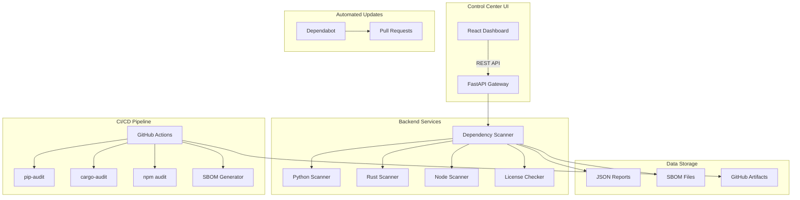

# Dependency Management Architecture

## Overview

The Sutra Models Dependency Management System provides comprehensive monitoring, scanning, and reporting capabilities for dependencies across our multi-language stack (Python, Rust, Node.js). The system is fully integrated into the Sutra Control Center and provides both automated and on-demand scanning capabilities.

## System Architecture



## Components

### 1. Control Center Integration

**Location:** `packages/sutra-control/`

#### Backend Service (`backend/dependency_scanner.py`)
- **Purpose:** Core scanning engine for all dependency operations
- **Key Classes:**
  - `DependencyScanner`: Main orchestrator
  - `PackageHealth`: Health metrics per package
  - `Vulnerability`: Vulnerability data model
  - `Dependency`: Individual dependency representation

**Features:**
- Parallel scanning across multiple packages
- Vulnerability aggregation and severity classification
- License compliance checking
- SBOM generation in CycloneDX format

#### Frontend Component (`src/components/DependencyDashboard.tsx`)
- **Purpose:** Visual interface for dependency monitoring
- **Technology:** React 18 + Material-UI + TypeScript
- **Key Features:**
  - Real-time health score visualization
  - Tabbed interface (Overview, Vulnerabilities, Details)
  - Filterable vulnerability list
  - SBOM download capability
  - Collapsible package details

#### API Endpoints
```
GET  /api/dependencies/scan         - Full system scan
GET  /api/dependencies/summary      - Quick summary stats
GET  /api/dependencies/sbom         - Generate SBOM
GET  /api/dependencies/vulnerabilities - List all vulnerabilities
```

### 2. CI/CD Integration

**Location:** `.github/workflows/dependency-security.yml`

#### Workflow Jobs
1. **python-security**: Scans Python dependencies with pip-audit
2. **rust-security**: Scans Rust dependencies with cargo-audit
3. **node-security**: Scans Node.js dependencies with npm audit
4. **license-check**: Validates license compliance
5. **generate-sbom**: Creates SBOM using Syft
6. **create-report**: Aggregates all results

**Triggers:**
- Daily schedule (2 AM UTC)
- Push to main/develop branches
- Pull request creation
- Manual dispatch

**Security Features:**
- Blocks PRs with critical vulnerabilities
- Uploads all reports as artifacts
- Comments summary on PRs
- Generates both CycloneDX and SPDX SBOM formats

### 3. Automated Updates

**Location:** `.github/dependabot.yml`

#### Configuration Strategy
- **Grouped Updates:** Related packages updated together
- **Scheduled Updates:** Weekly, staggered by ecosystem
- **Smart Limits:** 5 open PRs per ecosystem
- **Conventional Commits:** Automatic commit prefixes
- **Security Priority:** Immediate security updates

#### Ecosystem Coverage
- Python (pip) - 8 package directories
- Rust (cargo) - 7 crates
- Node.js (npm) - 3 packages
- Docker - Base images
- GitHub Actions - Workflow dependencies

### 4. Local Scanning

**Location:** `scripts/scan-dependencies.sh`

#### Features
- No Docker required
- Multi-language support
- Colored terminal output
- Report generation with timestamps
- macOS integration (auto-opens reports)

#### Output Structure
```
dependency-reports-YYYYMMDD-HHMMSS/
├── SUMMARY.md
├── python-dependencies.txt
├── rust-dependencies.txt
├── node-dependencies.txt
├── license-report.txt
├── *-audit.json (vulnerability data)
├── *-outdated.json (update data)
└── *-licenses.json (license data)
```

## Data Flow

### 1. Manual Scan Flow
```
User → Control Center UI → API Gateway → Dependency Scanner
    → Parallel Scanners → Aggregation → JSON Response → UI Display
```

### 2. Automated Scan Flow
```
Schedule/Trigger → GitHub Actions → Language Scanners
    → Report Generation → Artifact Storage → PR Comment
```

### 3. Update Flow
```
Dependabot → Dependency Check → PR Creation → CI Validation
    → Security Scan → Manual Review → Merge
```

## Security Model

### Vulnerability Classification
- **CRITICAL**: Immediate action required, blocks PRs
- **HIGH**: Urgent updates needed, alerts triggered
- **MODERATE**: Schedule updates, monitor
- **LOW**: Track for future updates
- **INFO**: Informational only

### License Compliance
**Problematic Licenses Detected:**
- GPL, AGPL, LGPL (copyleft)
- SSPL (Server Side Public License)
- Commons Clause (commercial restrictions)

**Approved License Categories:**
- MIT, Apache-2.0, BSD variants
- ISC, Unlicense
- Python-2.0, PSF

### Health Score Calculation
```python
health_score = max(0, 100 - (
    critical_vulns * 10 +
    high_vulns * 5 +
    outdated_deps * 1
))
```

## Performance Considerations

### Scanning Performance
- **Parallel Execution**: All packages scanned concurrently
- **Caching**: Results cached for 1 hour in Control Center
- **Incremental Scans**: Only changed packages rescanned
- **Timeout Protection**: 30-second timeout per package

### Storage Optimization
- **Report Rotation**: Keep last 30 days of reports
- **Compression**: JSON reports gzipped for storage
- **Artifact Retention**: GitHub keeps artifacts for 90 days

## Integration Points

### 1. Storage Server
- No direct integration (dependency scanning is independent)
- Future: Store vulnerability history in Sutra storage

### 2. Grid System
- No current integration
- Future: Distribute scanning across grid nodes

### 3. Embedding Service
- No dependency scanning for ML models
- Future: Model version tracking

### 4. Event System
- Future: Emit events for critical vulnerabilities
- Future: Track dependency update events

## Monitoring & Alerts

### Metrics Tracked
- Total dependencies per language
- Vulnerability count by severity
- Update lag (versions behind latest)
- License compliance rate
- SBOM generation time

### Alert Triggers
- Critical vulnerability detected
- License violation found
- Scan failure (3 consecutive)
- Unusual dependency addition (>10 new)

## Maintenance

### Regular Tasks
1. **Weekly**: Review Dependabot PRs
2. **Monthly**: Update scanner tools
3. **Quarterly**: License audit
4. **Yearly**: Dependency cleanup

### Tool Updates
```bash
# Update Python tools
pip install --upgrade pip-audit pip-licenses

# Update Rust tools
cargo install --force cargo-audit cargo-outdated

# Update Node tools
npm update -g license-checker
```

## Future Enhancements

### Phase 1 (Q1 2025)
- [ ] Historical vulnerability tracking
- [ ] Dependency graph visualization
- [ ] Custom security policies
- [ ] Slack/email notifications

### Phase 2 (Q2 2025)
- [ ] Container image scanning
- [ ] Binary dependency analysis
- [ ] Supply chain attestation
- [ ] SLSA compliance

### Phase 3 (Q3 2025)
- [ ] AI-powered update recommendations
- [ ] Automated PR testing
- [ ] Cross-repository dependency tracking
- [ ] Compliance reporting (SOC2, ISO27001)

## Troubleshooting

### Common Issues

**Scanner Not Found**
```bash
# Install missing scanners
pip install pip-audit
cargo install cargo-audit
```

**Scan Timeout**
- Increase timeout in `dependency_scanner.py`
- Check network connectivity
- Verify package registry access

**License Detection Failure**
- Ensure pip-licenses is updated
- Check for private packages
- Verify license field in package.json

**SBOM Generation Error**
- Update syft to latest version
- Check file permissions
- Verify JSON formatting

## References

- [CycloneDX Specification](https://cyclonedx.org/)
- [SPDX Specification](https://spdx.dev/)
- [OSV Database](https://osv.dev/)
- [GitHub Advisory Database](https://github.com/advisories)