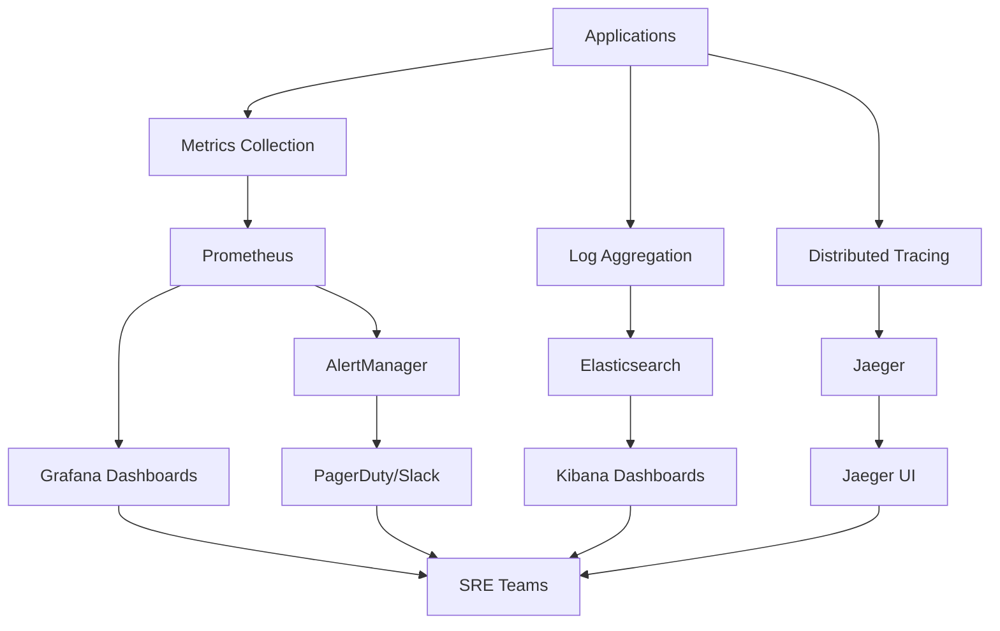

# Sutra AI Monitoring & Observability Guide

**Enterprise-Grade Observability & Performance Monitoring**

---

## 📊 Overview

The Sutra AI monitoring and observability framework provides **comprehensive system visibility** with real-time performance tracking, proactive alerting, and deep diagnostic capabilities. This enterprise-grade solution enables SRE teams to maintain system reliability and performance at scale.

### Observability Principles

- 📈 **Three Pillars**: Metrics, Logs, and Traces for complete visibility
- 📈 **Real-Time Insights**: Sub-second monitoring with immediate alerting
- 📈 **Proactive Detection**: ML-powered anomaly detection and forecasting  
- 📈 **Full Stack Coverage**: Infrastructure, application, and business metrics
- 📈 **SLI/SLO Driven**: Service-level objectives with error budgets
- 📈 **Self-Healing**: Automated remediation for common issues

## 🏗️ Monitoring Architecture

### System Overview


### Monitoring Stack Components

#### Metrics Collection (Prometheus Stack)
```yaml
# Prometheus configuration
services:
  prometheus:
    image: prom/prometheus:v2.40.0
    ports:
      - "9090:9090"
    volumes:
      - ./prometheus.yml:/etc/prometheus/prometheus.yml
      - prometheus_data:/prometheus
    command:
      - '--config.file=/etc/prometheus/prometheus.yml'
      - '--storage.tsdb.path=/prometheus'
      - '--web.console.libraries=/etc/prometheus/console_libraries'
      - '--web.console.templates=/etc/prometheus/consoles'
      - '--storage.tsdb.retention.time=90d'
      - '--web.enable-lifecycle'
      
  grafana:
    image: grafana/grafana:9.3.0
    ports:
      - "3000:3000"
    environment:
      - GF_SECURITY_ADMIN_PASSWORD=${GRAFANA_PASSWORD}
    volumes:
      - grafana_data:/var/lib/grafana
      - ./grafana/dashboards:/etc/grafana/provisioning/dashboards
      - ./grafana/datasources:/etc/grafana/provisioning/datasources
```

#### Log Aggregation (ELK Stack)
```yaml
# Elasticsearch, Logstash, Kibana configuration
services:
  elasticsearch:
    image: docker.elastic.co/elasticsearch/elasticsearch:8.5.0
    environment:
      - discovery.type=single-node
      - "ES_JAVA_OPTS=-Xms2g -Xmx2g"
      - xpack.security.enabled=false
    ports:
      - "9200:9200"
    volumes:
      - elasticsearch_data:/usr/share/elasticsearch/data
      
  logstash:
    image: docker.elastic.co/logstash/logstash:8.5.0
    volumes:
      - ./logstash/pipeline:/usr/share/logstash/pipeline
    ports:
      - "5044:5044"
    depends_on:
      - elasticsearch
      
  kibana:
    image: docker.elastic.co/kibana/kibana:8.5.0
    ports:
      - "5601:5601"
    environment:
      - ELASTICSEARCH_HOSTS=http://elasticsearch:9200
    depends_on:
      - elasticsearch
```

#### Distributed Tracing (Jaeger)
```yaml
# Jaeger tracing configuration  
services:
  jaeger:
    image: jaegertracing/all-in-one:1.40
    ports:
      - "16686:16686"  # Jaeger UI
      - "14268:14268"  # Jaeger collector HTTP
      - "6831:6831/udp"  # Jaeger agent UDP
    environment:
      - COLLECTOR_OTLP_ENABLED=true
```

## 📈 Metrics Collection & Visualization

### Application Metrics

#### Core Service Metrics
```python
# Prometheus metrics instrumentation
from prometheus_client import Counter, Histogram, Gauge, start_http_server

# Request metrics
REQUEST_COUNT = Counter(
    'sutra_requests_total',
    'Total HTTP requests',
    ['method', 'endpoint', 'status']
)

REQUEST_DURATION = Histogram(
    'sutra_request_duration_seconds',
    'Request duration in seconds',
    ['method', 'endpoint']
)

# Business metrics
EMBEDDINGS_GENERATED = Counter(
    'sutra_embeddings_generated_total',
    'Total embeddings generated'
)

STORAGE_OPERATIONS = Counter(
    'sutra_storage_operations_total', 
    'Total storage operations',
    ['operation_type', 'status']
)

# System metrics
ACTIVE_CONNECTIONS = Gauge(
    'sutra_active_connections',
    'Number of active connections'
)

MEMORY_USAGE = Gauge(
    'sutra_memory_usage_bytes',
    'Memory usage in bytes'
)
```

#### Performance SLIs (Service Level Indicators)
```python
class SLIMetrics:
    """Service Level Indicators for Sutra AI"""
    
    def __init__(self):
        # Availability SLI (uptime)
        self.availability = Gauge(
            'sutra_availability_ratio',
            'Service availability ratio (0-1)'
        )
        
        # Latency SLI (response time)
        self.latency_p95 = Histogram(
            'sutra_latency_p95_seconds',
            'Request latency 95th percentile'
        )
        
        # Quality SLI (error rate)
        self.error_rate = Gauge(
            'sutra_error_rate',
            'Error rate (errors/total requests)'
        )
        
        # Throughput SLI (requests per second)
        self.throughput = Gauge(
            'sutra_throughput_rps',
            'Requests per second'
        )
    
    def record_request(self, duration: float, status_code: int):
        """Record request metrics for SLI calculation"""
        self.latency_p95.observe(duration)
        
        if status_code >= 400:
            self.error_rate.inc()
            
        self.throughput.inc()
```

### Infrastructure Metrics

#### System Resource Monitoring
```python
# Node Exporter metrics for system monitoring
SYSTEM_METRICS = {
    # CPU metrics
    'node_cpu_seconds_total': 'CPU time spent in different modes',
    'node_load1': '1-minute load average',
    'node_load5': '5-minute load average', 
    'node_load15': '15-minute load average',
    
    # Memory metrics
    'node_memory_MemTotal_bytes': 'Total memory in bytes',
    'node_memory_MemFree_bytes': 'Free memory in bytes',
    'node_memory_MemAvailable_bytes': 'Available memory in bytes',
    'node_memory_Cached_bytes': 'Cached memory in bytes',
    
    # Disk metrics
    'node_filesystem_size_bytes': 'Filesystem size in bytes',
    'node_filesystem_free_bytes': 'Filesystem free space in bytes',
    'node_disk_io_time_seconds_total': 'Disk I/O time in seconds',
    
    # Network metrics
    'node_network_receive_bytes_total': 'Network receive bytes',
    'node_network_transmit_bytes_total': 'Network transmit bytes'
}
```

#### Docker Container Metrics
```python
# cAdvisor metrics for container monitoring
CONTAINER_METRICS = {
    # CPU metrics
    'container_cpu_usage_seconds_total': 'Container CPU usage',
    'container_cpu_throttled_seconds_total': 'Container CPU throttled time',
    
    # Memory metrics  
    'container_memory_usage_bytes': 'Container memory usage',
    'container_memory_working_set_bytes': 'Container working set memory',
    'container_memory_rss': 'Container RSS memory',
    
    # Network metrics
    'container_network_receive_bytes_total': 'Container network RX bytes',
    'container_network_transmit_bytes_total': 'Container network TX bytes',
    
    # Filesystem metrics
    'container_fs_usage_bytes': 'Container filesystem usage',
    'container_fs_reads_total': 'Container filesystem reads',
    'container_fs_writes_total': 'Container filesystem writes'
}
```

### Grafana Dashboard Configuration

#### Executive Dashboard
```json
{
  "dashboard": {
    "title": "Sutra AI - Executive Overview",
    "panels": [
      {
        "title": "System Health Score",
        "type": "stat",
        "targets": [{
          "expr": "avg(sutra_availability_ratio) * 100",
          "legendFormat": "Availability %"
        }]
      },
      {
        "title": "Request Rate", 
        "type": "graph",
        "targets": [{
          "expr": "sum(rate(sutra_requests_total[5m]))",
          "legendFormat": "Requests/sec"
        }]
      },
      {
        "title": "Response Time P95",
        "type": "graph", 
        "targets": [{
          "expr": "histogram_quantile(0.95, sum(rate(sutra_request_duration_seconds_bucket[5m])) by (le))",
          "legendFormat": "P95 Latency"
        }]
      },
      {
        "title": "Error Rate",
        "type": "graph",
        "targets": [{
          "expr": "sum(rate(sutra_requests_total{status=~\"4..|5..\"}[5m])) / sum(rate(sutra_requests_total[5m])) * 100",
          "legendFormat": "Error Rate %"
        }]
      }
    ]
  }
}
```

#### Technical Operations Dashboard  
```json
{
  "dashboard": {
    "title": "Sutra AI - Technical Operations",
    "panels": [
      {
        "title": "Service Status",
        "type": "table",
        "targets": [{
          "expr": "up{job=~\"sutra-.*\"}",
          "format": "table"
        }]
      },
      {
        "title": "CPU Usage by Service",
        "type": "graph",
        "targets": [{
          "expr": "rate(container_cpu_usage_seconds_total{name=~\"sutra-.*\"}[5m]) * 100",
          "legendFormat": "{{name}}"
        }]
      },
      {
        "title": "Memory Usage by Service",
        "type": "graph", 
        "targets": [{
          "expr": "container_memory_usage_bytes{name=~\"sutra-.*\"} / 1024 / 1024",
          "legendFormat": "{{name}}"
        }]
      },
      {
        "title": "Disk I/O",
        "type": "graph",
        "targets": [{
          "expr": "rate(node_disk_io_time_seconds_total[5m])",
          "legendFormat": "{{device}}"
        }]
      }
    ]
  }
}
```

## 📋 Logging & Log Analysis

### Structured Logging Implementation

#### Application Log Format
```python
import logging
import json
from datetime import datetime

class StructuredLogger:
    """Structured logging for Sutra AI applications"""
    
    def __init__(self, service_name: str):
        self.service_name = service_name
        self.logger = logging.getLogger(service_name)
        
        # Configure JSON formatter
        handler = logging.StreamHandler()
        formatter = self.JSONFormatter()
        handler.setFormatter(formatter)
        self.logger.addHandler(handler)
        self.logger.setLevel(logging.INFO)
    
    class JSONFormatter(logging.Formatter):
        def format(self, record):
            log_entry = {
                'timestamp': datetime.utcnow().isoformat() + 'Z',
                'service': record.name,
                'level': record.levelname,
                'message': record.getMessage(),
                'module': record.module,
                'function': record.funcName,
                'line': record.lineno
            }
            
            # Add request context if available
            if hasattr(record, 'request_id'):
                log_entry['request_id'] = record.request_id
            if hasattr(record, 'user_id'):
                log_entry['user_id'] = record.user_id
                
            return json.dumps(log_entry)
    
    def info(self, message: str, **kwargs):
        self.logger.info(message, extra=kwargs)
        
    def error(self, message: str, **kwargs):
        self.logger.error(message, extra=kwargs)
        
    def warning(self, message: str, **kwargs):
        self.logger.warning(message, extra=kwargs)
```

#### Request Tracing
```python
import uuid
from contextlib import contextmanager

class RequestTracer:
    """Distributed request tracing context"""
    
    def __init__(self):
        self.context = {}
    
    @contextmanager 
    def trace_request(self, request_id: str = None):
        """Create request tracing context"""
        if not request_id:
            request_id = str(uuid.uuid4())
            
        self.context['request_id'] = request_id
        self.context['start_time'] = time.time()
        
        try:
            yield request_id
        finally:
            duration = time.time() - self.context['start_time']
            logger.info(
                "Request completed",
                request_id=request_id,
                duration=duration
            )
            self.context.clear()
```

### Log Aggregation Pipeline

#### Logstash Configuration
```ruby
# logstash/pipeline/sutra-logs.conf
input {
  beats {
    port => 5044
  }
  
  docker {
    compose_file => "/docker-compose.yml"
  }
}

filter {
  # Parse JSON logs from applications
  if [fields][service] =~ /^sutra-/ {
    json {
      source => "message"
    }
    
    # Extract request timing
    if [request_id] {
      mutate {
        add_tag => ["traced_request"]
      }
    }
    
    # Grok patterns for non-JSON logs
  } else {
    grok {
      match => { 
        "message" => "%{TIMESTAMP_ISO8601:timestamp} %{LOGLEVEL:level} %{GREEDYDATA:message}"
      }
    }
  }
  
  # Add environment information
  mutate {
    add_field => { 
      "environment" => "${ENVIRONMENT:production}"
      "cluster" => "${CLUSTER_NAME:default}"
    }
  }
}

output {
  elasticsearch {
    hosts => ["elasticsearch:9200"]
    index => "sutra-logs-%{+YYYY.MM.dd}"
  }
  
  # Send critical errors to alerting
  if [level] == "ERROR" and [service] =~ /^sutra-/ {
    http {
      url => "http://alertmanager:9093/api/v1/alerts"
      http_method => "post"
      format => "json"
    }
  }
}
```

#### Kibana Index Patterns & Visualizations
```json
{
  "index_patterns": [
    {
      "title": "sutra-logs-*",
      "timeFieldName": "timestamp",
      "fields": {
        "service": {"type": "keyword"},
        "level": {"type": "keyword"},
        "request_id": {"type": "keyword"},
        "user_id": {"type": "keyword"},
        "response_time": {"type": "float"}
      }
    }
  ],
  "visualizations": [
    {
      "title": "Error Rate by Service",
      "type": "line",
      "query": "level:ERROR",
      "aggregation": "count",
      "group_by": "service"
    },
    {
      "title": "Response Time Distribution", 
      "type": "histogram",
      "field": "response_time",
      "interval": "auto"
    },
    {
      "title": "Top Error Messages",
      "type": "data_table",
      "query": "level:ERROR",
      "group_by": "message.keyword",
      "size": 10
    }
  ]
}
```

## 🔍 Distributed Tracing

### OpenTelemetry Integration

#### Trace Instrumentation
```python
from opentelemetry import trace
from opentelemetry.exporter.jaeger.thrift import JaegerExporter
from opentelemetry.sdk.trace import TracerProvider
from opentelemetry.sdk.trace.export import BatchSpanProcessor

# Configure tracer
trace.set_tracer_provider(TracerProvider())
tracer = trace.get_tracer(__name__)

jaeger_exporter = JaegerExporter(
    agent_host_name="jaeger",
    agent_port=6831,
)

span_processor = BatchSpanProcessor(jaeger_exporter)
trace.get_tracer_provider().add_span_processor(span_processor)

class TracedService:
    """Service with distributed tracing"""
    
    def __init__(self):
        self.tracer = trace.get_tracer(self.__class__.__name__)
    
    async def process_request(self, request_data: dict) -> dict:
        """Process request with full tracing"""
        with self.tracer.start_as_current_span("process_request") as span:
            # Add request attributes to span
            span.set_attribute("request.id", request_data.get("id"))
            span.set_attribute("request.user", request_data.get("user_id"))
            
            try:
                # Call downstream services with trace propagation
                result = await self.call_storage_service(request_data)
                span.set_attribute("result.success", True)
                return result
                
            except Exception as e:
                span.set_attribute("result.success", False)
                span.set_attribute("error.message", str(e))
                span.set_status(trace.Status(trace.StatusCode.ERROR))
                raise
    
    async def call_storage_service(self, data: dict) -> dict:
        """Call storage service with trace context"""
        with self.tracer.start_as_current_span("storage_call") as span:
            span.set_attribute("service.name", "sutra-storage")
            
            # HTTP request with trace headers
            headers = {}
            trace.propagation.inject(headers)
            
            async with aiohttp.ClientSession() as session:
                async with session.post(
                    "http://storage:50051/store",
                    json=data,
                    headers=headers
                ) as response:
                    span.set_attribute("http.status_code", response.status)
                    return await response.json()
```

### Performance Analysis with Traces

#### Trace Analysis Queries
```javascript
// Jaeger UI queries for performance analysis

// Find slow requests (>500ms)
{
  "service": "sutra-api",
  "operation": "process_request", 
  "tags": {"duration": ">500ms"}
}

// Find error traces
{
  "service": "*",
  "tags": {"error": "true"}
}

// Analyze service dependencies
{
  "service": "sutra-hybrid",
  "lookback": "1h",
  "limit": 100
}
```

## 🚨 Alerting & Incident Management

### AlertManager Configuration

#### Alert Rules (Prometheus)
```yaml
# alert-rules.yml
groups:
  - name: sutra-ai-alerts
    rules:
      # High error rate alert
      - alert: HighErrorRate
        expr: |
          sum(rate(sutra_requests_total{status=~"5.."}[5m])) 
          / sum(rate(sutra_requests_total[5m])) > 0.05
        for: 5m
        labels:
          severity: critical
          service: "{{ $labels.service }}"
        annotations:
          summary: "High error rate detected"
          description: "Error rate is {{ $value | humanizePercentage }} for service {{ $labels.service }}"
          
      # High latency alert
      - alert: HighLatency
        expr: |
          histogram_quantile(0.95, 
            sum(rate(sutra_request_duration_seconds_bucket[5m])) by (le)
          ) > 1.0
        for: 10m
        labels:
          severity: warning
        annotations:
          summary: "High request latency detected"
          description: "95th percentile latency is {{ $value }}s"
          
      # Service down alert
      - alert: ServiceDown
        expr: up{job=~"sutra-.*"} == 0
        for: 1m
        labels:
          severity: critical
          service: "{{ $labels.job }}"
        annotations:
          summary: "Service {{ $labels.job }} is down"
          description: "Service has been down for more than 1 minute"
          
      # High memory usage
      - alert: HighMemoryUsage
        expr: |
          container_memory_usage_bytes{name=~"sutra-.*"} 
          / container_spec_memory_limit_bytes > 0.90
        for: 15m
        labels:
          severity: warning
          service: "{{ $labels.name }}"
        annotations:
          summary: "High memory usage for {{ $labels.name }}"
          description: "Memory usage is {{ $value | humanizePercentage }}"
```

#### AlertManager Routing
```yaml
# alertmanager.yml
global:
  smtp_smarthost: 'mail.company.com:587'
  smtp_from: 'alerts@sutra.ai'

route:
  group_by: ['alertname', 'service']
  group_wait: 10s
  group_interval: 10s
  repeat_interval: 1h
  receiver: 'default'
  routes:
    - match:
        severity: critical
      receiver: 'pagerduty'
    - match:
        severity: warning  
      receiver: 'slack'

receivers:
  - name: 'default'
    email_configs:
      - to: 'team@sutra.ai'
        subject: 'Sutra Alert: {{ .GroupLabels.alertname }}'
        
  - name: 'pagerduty'
    pagerduty_configs:
      - service_key: '<pagerduty-integration-key>'
        description: '{{ .GroupLabels.alertname }}: {{ .CommonAnnotations.summary }}'
        
  - name: 'slack'
    slack_configs:
      - api_url: '<slack-webhook-url>'
        channel: '#sutra-alerts'
        title: 'Sutra Alert'
        text: '{{ .CommonAnnotations.description }}'
```

### Incident Response Automation

#### Auto-Remediation Scripts
```bash
#!/bin/bash
# auto-remediation.sh - Automated incident response

ALERT_NAME="$1"
SERVICE_NAME="$2" 
SEVERITY="$3"

case "$ALERT_NAME" in
    "HighMemoryUsage")
        echo "Triggering memory cleanup for $SERVICE_NAME"
        docker exec "$SERVICE_NAME" python -c "import gc; gc.collect()"
        
        # Scale service if needed
        if [ "$SEVERITY" = "critical" ]; then
            docker-compose up --scale "$SERVICE_NAME"=2
        fi
        ;;
        
    "HighLatency")
        echo "Scaling $SERVICE_NAME due to high latency"
        current_replicas=$(docker-compose ps -q "$SERVICE_NAME" | wc -l)
        new_replicas=$((current_replicas + 1))
        docker-compose up --scale "$SERVICE_NAME"="$new_replicas"
        ;;
        
    "ServiceDown")
        echo "Restarting $SERVICE_NAME"
        docker-compose restart "$SERVICE_NAME"
        
        # Wait for health check
        sleep 30
        ./sutrabuild/scripts/health-check.sh "http://localhost:8000/health"
        ;;
        
    "HighErrorRate")
        echo "Rolling back $SERVICE_NAME due to high error rate"
        ./sutra-deploy.sh rollback --service "$SERVICE_NAME" --confirm
        ;;
esac

# Send notification
./sutrabuild/scripts/send-notification.sh \
    --type "auto-remediation" \
    --alert "$ALERT_NAME" \
    --service "$SERVICE_NAME" \
    --action "$(history | tail -1)"
```

#### Incident Classification & Response
```python
class IncidentManager:
    """Automated incident management system"""
    
    SEVERITY_LEVELS = {
        'P0': {'response_time': 15, 'escalation': ['oncall', 'manager', 'director']},
        'P1': {'response_time': 60, 'escalation': ['oncall', 'manager']},
        'P2': {'response_time': 240, 'escalation': ['oncall']},
        'P3': {'response_time': 1440, 'escalation': ['team']}
    }
    
    def __init__(self):
        self.alert_processor = AlertProcessor()
        self.notification_service = NotificationService()
        
    async def process_alert(self, alert: dict):
        """Process incoming alert and determine response"""
        
        # Classify incident severity
        severity = self.classify_severity(alert)
        
        # Check for auto-remediation
        if self.can_auto_remediate(alert):
            success = await self.auto_remediate(alert)
            if success:
                await self.notification_service.send_notification(
                    f"Auto-remediation successful for {alert['alertname']}"
                )
                return
        
        # Create incident ticket
        incident_id = await self.create_incident(alert, severity)
        
        # Trigger escalation chain
        await self.trigger_escalation(incident_id, severity)
        
    def classify_severity(self, alert: dict) -> str:
        """Classify alert severity based on impact and urgency"""
        
        # Critical system components
        if alert.get('service') in ['sutra-storage', 'sutra-api']:
            if alert.get('severity') == 'critical':
                return 'P0'
            else:
                return 'P1'
                
        # High error rates
        if 'ErrorRate' in alert.get('alertname', ''):
            error_rate = float(alert.get('value', 0))
            if error_rate > 0.10:  # 10% error rate
                return 'P0'
            elif error_rate > 0.05:  # 5% error rate  
                return 'P1'
            else:
                return 'P2'
                
        # Default classification
        severity_map = {
            'critical': 'P1',
            'warning': 'P2', 
            'info': 'P3'
        }
        return severity_map.get(alert.get('severity', 'warning'), 'P2')
```

## 📊 SLO Management & Error Budgets

### Service Level Objectives

#### SLO Definitions
```yaml
# slo-definitions.yml
slos:
  sutra-api:
    availability:
      objective: 99.9%
      measurement_window: 30d
      error_budget: 0.1%
      
    latency:
      objective: 95% of requests < 100ms
      measurement_window: 7d
      
    error_rate:
      objective: < 0.5% error rate
      measurement_window: 24h
      
  sutra-storage:
    availability:
      objective: 99.95%
      measurement_window: 30d
      
    throughput:
      objective: > 50K writes/second
      measurement_window: 1h
      
  sutra-embedding:
    availability: 
      objective: 99.9%
      measurement_window: 30d
      
    latency:
      objective: 95% of requests < 500ms
      measurement_window: 24h
```

#### Error Budget Tracking
```python
class ErrorBudgetTracker:
    """Track error budgets for SLO compliance"""
    
    def __init__(self):
        self.prometheus_client = PrometheusClient()
        
    async def calculate_error_budget(self, service: str, slo_type: str) -> dict:
        """Calculate current error budget consumption"""
        
        slo_config = self.load_slo_config(service, slo_type)
        window = slo_config['measurement_window']
        objective = slo_config['objective']
        
        if slo_type == 'availability':
            # Calculate uptime percentage
            uptime_query = f"""
                avg_over_time(up{{job="{service}"}}[{window}])
            """
            uptime = await self.prometheus_client.query(uptime_query)
            current_availability = uptime * 100
            
            error_budget_consumed = (
                (objective - current_availability) / (100 - objective)
            ) * 100
            
        elif slo_type == 'latency':
            # Calculate latency SLI
            latency_query = f"""
                histogram_quantile(0.95,
                  sum(rate(sutra_request_duration_seconds_bucket{{service="{service}"}}[{window}])) by (le)
                )
            """
            p95_latency = await self.prometheus_client.query(latency_query)
            
            threshold = float(slo_config['threshold'].rstrip('ms')) / 1000
            sli_value = min(p95_latency / threshold, 1.0) * 100
            
            error_budget_consumed = (
                (objective - sli_value) / (100 - objective)
            ) * 100
            
        return {
            'service': service,
            'slo_type': slo_type, 
            'objective': objective,
            'current_sli': current_availability if slo_type == 'availability' else sli_value,
            'error_budget_consumed': error_budget_consumed,
            'error_budget_remaining': 100 - error_budget_consumed
        }
```

### Performance Benchmarking

#### Automated Performance Testing  
```bash
#!/bin/bash
# performance-benchmark.sh

ENDPOINT="http://localhost:8000"
DURATION=300  # 5 minutes
USERS=100
RESULTS_DIR="/var/log/sutra/performance"

# Create results directory
mkdir -p "$RESULTS_DIR"
TIMESTAMP=$(date +%Y%m%d_%H%M%S)

# Run load test
echo "Starting performance benchmark: $TIMESTAMP"

# API endpoint tests
curl -X POST "$ENDPOINT/embed" \
    -H "Content-Type: application/json" \
    -d '{"texts": ["test embedding"], "normalize": true}' \
    --output /dev/null \
    --write-out '@curl-format.txt' \
    --silent \
    > "$RESULTS_DIR/api_latency_$TIMESTAMP.log"

# Concurrent user simulation
ab -n 1000 -c 10 -g "$RESULTS_DIR/ab_results_$TIMESTAMP.tsv" \
    -H "Content-Type: application/json" \
    -p payload.json \
    "$ENDPOINT/embed" > "$RESULTS_DIR/ab_summary_$TIMESTAMP.log"

# Generate performance report
python3 << EOF
import json
import pandas as pd
from datetime import datetime

# Load test results
with open('$RESULTS_DIR/ab_summary_$TIMESTAMP.log') as f:
    ab_results = f.read()

# Extract metrics
import re
rps_match = re.search(r'Requests per second:\s+(\d+\.\d+)', ab_results)
latency_match = re.search(r'Time per request:\s+(\d+\.\d+)', ab_results)

performance_report = {
    'timestamp': '$TIMESTAMP',
    'requests_per_second': float(rps_match.group(1)) if rps_match else 0,
    'avg_latency_ms': float(latency_match.group(1)) if latency_match else 0,
    'test_duration': $DURATION,
    'concurrent_users': $USERS
}

# Save report
with open('$RESULTS_DIR/performance_report_$TIMESTAMP.json', 'w') as f:
    json.dump(performance_report, f, indent=2)
    
print(f"Performance benchmark completed: {performance_report}")
EOF
```

## 🔧 Monitoring Automation

### Health Check Automation

#### Comprehensive Health Monitoring
```bash
#!/bin/bash
# comprehensive-health-check.sh

HEALTH_CHECK_LOG="/var/log/sutra/health-checks.log" 
SERVICES=("sutra-api" "sutra-hybrid" "sutra-storage" "sutra-embedding")

log() {
    echo "$(date '+%Y-%m-%d %H:%M:%S') - $1" | tee -a "$HEALTH_CHECK_LOG"
}

check_service_health() {
    local service="$1"
    local endpoint="$2"
    
    log "Checking health of $service at $endpoint"
    
    response=$(curl -s -w "\n%{http_code}\n%{time_total}" "$endpoint" 2>/dev/null)
    http_code=$(echo "$response" | tail -n2 | head -n1)
    response_time=$(echo "$response" | tail -n1)
    
    if [ "$http_code" = "200" ]; then
        log "✅ $service: Healthy (${response_time}s)"
        return 0
    else
        log "❌ $service: Unhealthy (HTTP $http_code)"
        return 1
    fi
}

# Main health check loop
failed_checks=0

for service in "${SERVICES[@]}"; do
    case "$service" in
        "sutra-api")
            check_service_health "$service" "http://localhost:8000/health"
            ;;
        "sutra-hybrid")
            check_service_health "$service" "http://localhost:8001/health" 
            ;;
        "sutra-embedding")
            check_service_health "$service" "http://localhost:8888/health"
            ;;
        "sutra-storage")
            # TCP health check for storage service
            if timeout 5 bash -c "</dev/tcp/localhost/50051"; then
                log "✅ sutra-storage: Healthy (TCP connection successful)"
            else
                log "❌ sutra-storage: Unhealthy (TCP connection failed)"
                ((failed_checks++))
            fi
            ;;
    esac
    
    if [ $? -ne 0 ]; then
        ((failed_checks++))
    fi
done

# Generate health score
total_services=${#SERVICES[@]}
health_score=$(( (total_services - failed_checks) * 100 / total_services ))

log "Health Check Summary: $health_score% ($((total_services - failed_checks))/$total_services services healthy)"

# Send metrics to monitoring system
curl -X POST http://localhost:9091/metrics/job/health-check \
    --data-binary "sutra_health_score{job=\"health-check\"} $health_score"

# Alert if health score is below threshold
if [ "$health_score" -lt 80 ]; then
    ./sutrabuild/scripts/send-alert.sh \
        --severity critical \
        --message "System health score below threshold: $health_score%" \
        --service "system-wide"
fi
```

### Capacity Planning

#### Resource Utilization Analysis
```python
#!/usr/bin/env python3
"""
Capacity planning and forecasting system
"""

import pandas as pd
import numpy as np
from datetime import datetime, timedelta
from prometheus_api_client import PrometheusConnect
import matplotlib.pyplot as plt

class CapacityPlanner:
    def __init__(self, prometheus_url: str):
        self.prom = PrometheusConnect(url=prometheus_url)
        
    def analyze_resource_trends(self, days_back: int = 30) -> dict:
        """Analyze resource utilization trends"""
        
        end_time = datetime.now()
        start_time = end_time - timedelta(days=days_back)
        
        # CPU utilization trend
        cpu_query = """
            avg(rate(container_cpu_usage_seconds_total{name=~"sutra-.*"}[5m])) by (name)
        """
        cpu_data = self.prom.get_metric_range_data(
            metric_name=cpu_query,
            start_time=start_time,
            end_time=end_time
        )
        
        # Memory utilization trend  
        memory_query = """
            avg(container_memory_usage_bytes{name=~"sutra-.*"}) by (name) / 1024/1024/1024
        """
        memory_data = self.prom.get_metric_range_data(
            metric_name=memory_query,
            start_time=start_time,
            end_time=end_time
        )
        
        # Storage utilization trend
        storage_query = """
            avg(container_fs_usage_bytes{name=~"sutra-.*"}) by (name) / 1024/1024/1024
        """
        storage_data = self.prom.get_metric_range_data(
            metric_name=storage_query, 
            start_time=start_time,
            end_time=end_time
        )
        
        return {
            'cpu': self.process_metric_data(cpu_data),
            'memory': self.process_metric_data(memory_data), 
            'storage': self.process_metric_data(storage_data)
        }
    
    def forecast_resource_needs(self, historical_data: dict, days_ahead: int = 90) -> dict:
        """Forecast future resource requirements"""
        
        forecasts = {}
        
        for resource_type, data in historical_data.items():
            for service, values in data.items():
                # Simple linear regression for trend
                x = np.arange(len(values))
                y = np.array(values)
                
                # Calculate trend
                slope, intercept = np.polyfit(x, y, 1)
                
                # Forecast future values
                future_x = np.arange(len(values), len(values) + days_ahead)
                forecast_values = slope * future_x + intercept
                
                forecasts[f"{service}_{resource_type}"] = {
                    'current_avg': np.mean(values[-7:]),  # Last week average
                    'trend_slope': slope,
                    'forecast_90d': forecast_values[-1],
                    'growth_rate': (slope / np.mean(values)) * 100 if np.mean(values) > 0 else 0
                }
        
        return forecasts
    
    def generate_capacity_report(self) -> dict:
        """Generate comprehensive capacity planning report"""
        
        # Analyze trends
        trends = self.analyze_resource_trends(30)
        
        # Generate forecasts  
        forecasts = self.forecast_resource_needs(trends, 90)
        
        # Calculate recommendations
        recommendations = []
        
        for resource, forecast in forecasts.items():
            if forecast['growth_rate'] > 20:  # 20% monthly growth
                recommendations.append({
                    'resource': resource,
                    'action': 'scale_up',
                    'urgency': 'high' if forecast['growth_rate'] > 50 else 'medium',
                    'reason': f"High growth rate: {forecast['growth_rate']:.1f}%/month"
                })
            elif forecast['forecast_90d'] > forecast['current_avg'] * 2:
                recommendations.append({
                    'resource': resource, 
                    'action': 'plan_expansion',
                    'urgency': 'medium',
                    'reason': f"Projected 2x growth in 90 days"
                })
        
        return {
            'generated_at': datetime.now().isoformat(),
            'analysis_period': '30 days',
            'forecast_horizon': '90 days',
            'trends': trends,
            'forecasts': forecasts,
            'recommendations': recommendations
        }
```

---

## 📚 Additional Resources

- **[Architecture Guide](ARCHITECTURE.md)**: Technical monitoring architecture
- **[Security Guide](SECURITY.md)**: Security monitoring and incident response
- **[Deployment Guide](DEPLOYMENT.md)**: Production monitoring setup
- **[Build Reference](BUILD_REFERENCE.md)**: Monitoring-related build commands
- **[Troubleshooting](TROUBLESHOOTING.md)**: Monitoring and diagnostic procedures

---

> **Observability Excellence**: This monitoring framework provides enterprise-grade observability with comprehensive metrics, logging, tracing, and alerting. Every component has been designed for production reliability and operational excellence at scale.