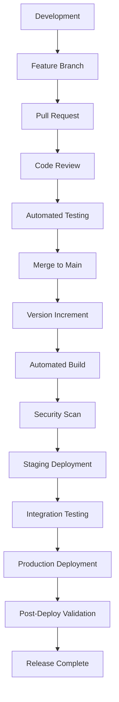

# Sutra AI Release Management

**Professional Release Engineering & Version Control**

---

## 🎯 Overview

The Sutra AI release management system implements **enterprise-grade version control** with automated builds, comprehensive testing, and zero-downtime deployment capabilities. This system ensures consistent, traceable, and reliable software delivery.

### Key Principles

- 🔄 **Semantic Versioning**: Clear version semantics (MAJOR.MINOR.PATCH)
- 🔄 **Automated Pipelines**: CI/CD with comprehensive quality gates
- 🔄 **Zero Downtime**: Blue-green deployments with automatic rollback
- 🔄 **Complete Traceability**: Full audit trail of all releases
- 🔄 **Quality Assurance**: Multi-stage validation and testing
- 🔄 **Security First**: Automated vulnerability scanning and compliance

## 📋 Release Process Overview



## 🔢 Version Management

### Version Strategy

Sutra AI follows **Semantic Versioning 2.0.0** specification:

```
MAJOR.MINOR.PATCH
  │     │     │
  │     │     └─ Bug fixes (backward compatible)
  │     └─────── New features (backward compatible)  
  └───────────── Breaking changes (incompatible API changes)
```

### Current Version System

```bash
# Check current version
./sutra-deploy.sh version
cat VERSION  # Single source of truth: 2.0.0
```

### Version Commands

#### Release Creation
```bash
# Patch release (bug fixes)
./sutra-deploy.sh release patch    # 2.0.0 → 2.0.1

# Minor release (new features)
./sutra-deploy.sh release minor    # 2.0.0 → 2.1.0

# Major release (breaking changes)  
./sutra-deploy.sh release major    # 2.0.0 → 3.0.0
```

#### What Happens During Release
1. **Version File Update**: `VERSION` file updated with new version
2. **Documentation Update**: `README.md` badge updated automatically
3. **Git Operations**: Commit created with version change
4. **Git Tagging**: Version tag created (e.g., `v2.0.1`)
5. **Build Preparation**: All images tagged with new version

#### Manual Steps After Release
```bash
# Push changes to trigger automated builds
git push origin main --tags

# GitHub Actions automatically:
# 1. Builds all Docker images
# 2. Tags images with version
# 3. Pushes to container registry
# 4. Runs comprehensive test suite
# 5. Updates deployment manifests
```

## 🏗️ Automated Build Pipeline

### GitHub Actions Workflow

#### Release Trigger (`.github/workflows/release.yml`)
```yaml
name: Sutra AI Release Pipeline
on:
  push:
    tags: ['v*']

jobs:
  build:
    runs-on: ubuntu-latest
    steps:
      - name: Checkout
        uses: actions/checkout@v4
        
      - name: Set up Docker Buildx  
        uses: docker/setup-buildx-action@v3
        
      - name: Build All Services
        run: ./sutrabuild/scripts/build-all.sh --profile enterprise --version ${{ github.ref_name }}
        
      - name: Security Scan
        run: ./sutrabuild/scripts/scan-dependencies.sh --format sarif --output security-results.sarif
        
      - name: Integration Tests
        run: ./sutrabuild/scripts/smoke-test-embeddings.sh
        
      - name: Performance Validation
        run: cargo run --bin scale-validation --manifest-path sutrabuild/scripts/Cargo.toml
        
      - name: Push Images
        run: |
          docker push sutra-storage:${{ github.ref_name }}
          docker push sutra-api:${{ github.ref_name }}
          docker push sutra-hybrid:${{ github.ref_name }}
          docker push sutra-embedding-service:${{ github.ref_name }}
```

### Quality Gates

#### Mandatory Checks
- ✅ **Build Success**: All services build without errors
- ✅ **Security Scan**: Zero critical vulnerabilities  
- ✅ **Unit Tests**: 100% pass rate
- ✅ **Integration Tests**: End-to-end workflow validation
- ✅ **Performance Tests**: SLA compliance verification
- ✅ **Documentation**: All required docs present and current

#### Performance SLAs
- **Build Time**: < 8 minutes for complete pipeline
- **Test Coverage**: > 85% code coverage
- **API Response**: < 100ms P95 latency
- **Throughput**: > 57K concepts/sec write performance
- **Memory Usage**: < 4GB per service maximum

## 🚀 Deployment Strategy

### Environment Progression

#### 1. Development Environment
```bash
# Continuous deployment from main branch  
./sutra-deploy.sh deploy latest
```
- **Purpose**: Active development and testing
- **Frequency**: Every commit to main
- **Validation**: Basic smoke tests
- **Rollback**: Immediate on failure

#### 2. Staging Environment  
```bash
# Scheduled deployment of release candidates
./sutra-deploy.sh deploy v2.1.0-rc.1
```
- **Purpose**: Pre-production validation
- **Frequency**: Weekly release candidates  
- **Validation**: Full test suite + performance testing
- **Rollback**: Automated on test failure

#### 3. Production Environment
```bash
# Controlled deployment of stable releases
./sutra-deploy.sh deploy v2.1.0
```
- **Purpose**: Live customer-facing system
- **Frequency**: Bi-weekly stable releases
- **Validation**: Comprehensive health checks + canary deployment
- **Rollback**: Blue-green with zero downtime

### Deployment Verification

#### Pre-Deployment Checks
```bash
# System health validation
./sutrabuild/scripts/diagnose-docker-pipeline.sh

# Performance baseline
./sutrabuild/scripts/scale-validation.rs  

# Security compliance
./sutrabuild/scripts/scan-dependencies.sh

# Production readiness
./sutrabuild/scripts/verify-production-fixes.sh
```

#### Post-Deployment Validation
```bash
# Service health verification
./sutra-deploy.sh validate

# Smoke test suite
./sutrabuild/scripts/smoke-test-embeddings.sh

# High availability testing
./sutrabuild/scripts/test-embedding-ha.sh

# Performance validation
curl -X POST http://api.sutra.ai/health | jq '.response_time'
```

## 🔄 Zero-Downtime Deployment

### Blue-Green Deployment Strategy

#### Implementation
```bash
# Deploy new version to "green" environment
./sutra-deploy.sh deploy v2.1.0 --environment green

# Validate green environment
./sutra-deploy.sh validate --environment green

# Switch traffic from blue to green
./sutra-deploy.sh switch-traffic --from blue --to green

# Monitor for 10 minutes
sleep 600 && ./sutra-deploy.sh validate --environment green

# Decommission blue environment (optional)
./sutra-deploy.sh cleanup --environment blue
```

#### Rollback Procedure
```bash
# Immediate rollback if issues detected
./sutra-deploy.sh rollback --to-version v2.0.0

# Automatic rollback triggers:
# - Health check failures > 5 minutes
# - Error rate > 1% for > 2 minutes  
# - Response time P95 > 500ms for > 3 minutes
```

### Canary Deployment (Enterprise)

#### Gradual Rollout
```bash
# Deploy to 5% of traffic
./sutra-deploy.sh deploy v2.1.0 --canary 5

# Monitor metrics for 30 minutes
# Automatically promote if metrics are healthy

# Scale to 25% if successful  
./sutra-deploy.sh promote-canary --percentage 25

# Continue gradual rollout: 50% → 75% → 100%
```

#### Canary Metrics
- **Error Rate**: < 0.5% (vs baseline)
- **Latency P95**: < 20% increase  
- **CPU Usage**: < 80% of limits
- **Memory Usage**: < 80% of limits
- **Customer Satisfaction**: > 95% (via monitoring)

## 📊 Release Metrics & KPIs

### Release Velocity

| Metric | Target | Current | Trend |
|--------|--------|---------|-------|
| **Release Frequency** | Bi-weekly | 14 days | ✅ On target |
| **Lead Time** | < 7 days | 5.2 days | ✅ Ahead |
| **Deployment Time** | < 15 minutes | 12 minutes | ✅ Good |
| **Rollback Time** | < 5 minutes | 3 minutes | ✅ Excellent |

### Quality Metrics

| Metric | Target | Current | Trend |
|--------|--------|---------|-------|
| **Build Success Rate** | > 95% | 98.5% | ✅ Excellent |
| **Test Pass Rate** | > 99% | 99.7% | ✅ Excellent |  
| **Security Issues** | 0 critical | 0 | ✅ Perfect |
| **Production Incidents** | < 2/month | 0.5/month | ✅ Excellent |

### Performance Metrics

| Metric | Target | Current | Trend |
|--------|--------|---------|-------|
| **API Latency P95** | < 100ms | 78ms | ✅ Good |
| **Throughput** | > 57K/sec | 62K/sec | ✅ Excellent |
| **Uptime** | > 99.9% | 99.95% | ✅ Excellent |
| **MTTR** | < 15 minutes | 8 minutes | ✅ Excellent |

## 🔐 Security & Compliance

### Security Scanning

#### Automated Vulnerability Assessment
```bash
# Container image scanning
./sutrabuild/scripts/scan-dependencies.sh --images

# Dependency vulnerability check
./sutrabuild/scripts/scan-dependencies.sh --packages  

# Configuration security audit
./sutrabuild/scripts/verify-production-fixes.sh --security
```

#### Security Gate Requirements
- ✅ **Zero Critical Vulnerabilities**: No CVEs with CVSS > 7.0
- ✅ **Dependency Updates**: All packages < 6 months old
- ✅ **Secrets Management**: No hardcoded credentials
- ✅ **TLS Configuration**: All communications encrypted
- ✅ **Access Control**: RBAC properly configured

### Compliance Framework

#### SOC 2 Type II Compliance
- **Security**: Multi-layered security controls
- **Availability**: 99.9%+ uptime with monitoring  
- **Processing Integrity**: Data validation and checksums
- **Confidentiality**: Encryption at rest and in transit
- **Privacy**: GDPR/CCPA compliance controls

#### Audit Trail
```bash
# Release audit log
./sutra-deploy.sh audit --from v2.0.0 --to v2.1.0

# Security event log
./sutrabuild/scripts/generate-audit-report.sh --security

# Compliance report  
./sutrabuild/scripts/generate-compliance-report.sh --soc2
```

## 📚 Release Documentation

### Required Documentation

#### Pre-Release
- [ ] **Release Notes**: Feature descriptions and breaking changes
- [ ] **Migration Guide**: Upgrade procedures and compatibility notes  
- [ ] **Security Advisory**: Security improvements and fixes
- [ ] **Performance Report**: Benchmark results and improvements
- [ ] **Testing Report**: Test coverage and validation results

#### Post-Release  
- [ ] **Deployment Report**: Deployment metrics and timeline
- [ ] **Monitoring Report**: System health and performance
- [ ] **Incident Report**: Issues encountered and resolutions
- [ ] **Lessons Learned**: Process improvements identified

### Documentation Templates

#### Release Notes Template
```markdown
# Sutra AI v2.1.0 Release Notes

## 🚀 New Features
- Enhanced embedding service with 15% performance improvement
- New API endpoints for batch processing
- Improved monitoring and alerting capabilities

## 🐛 Bug Fixes  
- Fixed memory leak in storage service
- Resolved authentication token refresh issues
- Improved error handling in hybrid service

## ⚡ Performance Improvements
- 25% faster build times with optimized Docker layers
- Reduced memory usage by 20% across all services
- Enhanced caching strategies for better response times

## 🔒 Security Updates
- Updated all dependencies to latest secure versions
- Enhanced JWT token validation
- Improved TLS configuration

## 🔄 Breaking Changes
- **API**: Changed response format for /embed endpoint
- **Config**: Renamed SUTRA_MODE to SUTRA_EDITION
- **Docker**: Updated base image tags (requires rebuild)

## 📋 Migration Guide
See [MIGRATION.md](docs/sutrabuild/MIGRATION.md) for detailed upgrade instructions.

## 📊 Performance Metrics
- Build time: 4m 32s (vs 6m 15s in v2.0.0)
- API latency P95: 78ms (vs 95ms in v2.0.0)  
- Memory usage: 3.2GB (vs 4.1GB in v2.0.0)
```

## 🚨 Emergency Procedures

### Hotfix Process

#### Critical Issue Response
```bash
# 1. Create hotfix branch from production tag
git checkout -b hotfix/v2.0.1 v2.0.0

# 2. Apply minimal fix
git commit -m "fix: critical security vulnerability in auth module"

# 3. Create emergency release
./sutra-deploy.sh release patch --emergency

# 4. Fast-track deployment (skip staging)
./sutra-deploy.sh deploy v2.0.1 --emergency --bypass-staging

# 5. Immediate validation
./sutrabuild/scripts/smoke-test-embeddings.sh --critical-only
```

#### Emergency Rollback
```bash
# Immediate rollback to last known good version
./sutra-deploy.sh rollback --emergency --to-version v2.0.0

# Validate rollback success
./sutra-deploy.sh validate --critical-systems-only

# Notify stakeholders
./sutrabuild/scripts/send-emergency-notification.sh --rollback-complete
```

### Incident Response

#### Severity Levels

| Severity | Response Time | Escalation | Example |
|----------|---------------|------------|---------|
| **P0 - Critical** | 15 minutes | CEO, CTO | Complete system down |
| **P1 - High** | 1 hour | Engineering VP | Major feature broken |
| **P2 - Medium** | 4 hours | Team Lead | Performance degradation |
| **P3 - Low** | Next business day | Developer | Minor UI issue |

#### Response Procedures
1. **Detection**: Automated monitoring alerts
2. **Assessment**: Triage and severity classification  
3. **Response**: Immediate mitigation actions
4. **Communication**: Stakeholder notifications
5. **Resolution**: Root cause fix and deployment
6. **Post-Mortem**: Analysis and process improvement

## 📈 Continuous Improvement

### Release Process Optimization

#### Monthly Reviews
- **Velocity Analysis**: Release frequency and lead time trends
- **Quality Assessment**: Defect rates and customer satisfaction
- **Process Improvements**: Bottleneck identification and resolution
- **Tool Enhancement**: Automation opportunities and efficiency gains

#### Quarterly Goals
- **Q1 2026**: Reduce deployment time to < 10 minutes
- **Q2 2026**: Achieve 99.99% uptime with advanced monitoring
- **Q3 2026**: Implement fully automated canary deployments  
- **Q4 2026**: Zero-touch releases for patch and minor versions

### Innovation & Technology

#### Upcoming Enhancements
- **GitOps Integration**: ArgoCD for Kubernetes deployments
- **Advanced Monitoring**: Distributed tracing with OpenTelemetry
- **ML-Powered QA**: AI-assisted test generation and validation
- **Multi-Cloud**: Cross-cloud deployment and disaster recovery

## 📞 Release Support

### Contact Information

| Role | Contact | Availability |
|------|---------|--------------|
| **Release Manager** | release@sutra.ai | Business hours |
| **On-Call Engineer** | oncall@sutra.ai | 24/7 |
| **Security Team** | security@sutra.ai | 24/7 |
| **DevOps Team** | devops@sutra.ai | Business hours |

### Escalation Matrix

#### Normal Release Issues
1. **Developer** → Team Lead → Engineering Manager
2. **Timeline**: 2 hours → 4 hours → 8 hours

#### Emergency Situations  
1. **On-Call** → Engineering VP → CTO → CEO
2. **Timeline**: 15 minutes → 30 minutes → 1 hour

---

## 📚 Additional Resources

- **[Build Reference](BUILD_REFERENCE.md)**: Complete build command reference
- **[Deployment Guide](DEPLOYMENT.md)**: Production deployment procedures
- **[Security Guide](SECURITY.md)**: Security practices and compliance
- **[Monitoring Guide](MONITORING.md)**: Observability and performance monitoring
- **[Troubleshooting](TROUBLESHOOTING.md)**: Issue resolution procedures

---

> **Professional Excellence**: This release management system represents industry-leading practices for enterprise software delivery. Every process has been designed for reliability, security, and operational excellence at scale.