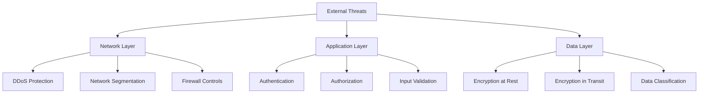

# Sutra AI Security Guide

**Enterprise Security Framework & Compliance Standards**

---

## 🔐 Overview

The Sutra AI security framework implements **defense-in-depth strategies** with comprehensive security controls, compliance frameworks, and incident response procedures. This guide provides complete security implementation and operational procedures for production environments.

### Security Principles

- 🛡️ **Zero Trust Architecture**: Verify everything, trust nothing
- 🛡️ **Defense in Depth**: Multiple layers of security controls
- 🛡️ **Least Privilege**: Minimal access rights by default
- 🛡️ **Security by Design**: Security integrated from development
- 🛡️ **Continuous Monitoring**: Real-time threat detection
- 🛡️ **Compliance First**: Built-in regulatory compliance

## 🎯 Security Architecture

### Threat Model

#### Attack Surface Analysis


#### Threat Categories

| Category | Risk Level | Mitigation Strategy |
|----------|------------|-------------------|
| **External Attacks** | High | WAF, DDoS protection, Network segmentation |
| **Insider Threats** | Medium | RBAC, Audit logging, Behavioral monitoring |
| **Supply Chain** | High | Dependency scanning, Container security |
| **Data Breaches** | Critical | Encryption, Access controls, DLP |
| **Service Disruption** | High | HA architecture, Incident response |

### Security Layers

#### 1. Network Security
```yaml
# Firewall Rules (UFW Configuration)
rules:
  - direction: incoming
    policy: deny
    default: true
  
  - port: 443
    protocol: tcp
    action: allow
    comment: "HTTPS Production Traffic"
    
  - port: 22
    protocol: tcp  
    source: "admin_ips_only"
    action: allow
    comment: "SSH Administrative Access"
    
  - port: 8000-8888
    protocol: tcp
    source: "internal_networks"
    action: allow
    comment: "Internal Service Communication"
```

#### 2. Container Security
```dockerfile
# Security-hardened container configuration
FROM python:3.11-slim

# Non-root user execution (Security Control)
RUN groupadd -g 1000 sutra && \
    useradd -m -u 1000 -g sutra sutra

# Read-only filesystem (Security Control)
COPY --chown=sutra:sutra . /app
RUN chmod -R 555 /app

# Drop capabilities (Security Control) 
USER 1000:1000
WORKDIR /app

# Resource limits (DoS Prevention)
LABEL security.memory.limit="2G"
LABEL security.cpu.limit="1.0"
```

#### 3. Application Security
```python
# Authentication & Authorization Framework
class SecurityFramework:
    def __init__(self):
        self.auth_backend = HMACTokenAuth()
        self.authz_backend = RBACAuthorization()
        self.audit_logger = SecurityAuditLogger()
    
    async def authenticate_request(self, request):
        token = self.extract_token(request)
        claims = self.auth_backend.verify_token(token)
        user = self.load_user(claims['sub'])
        
        # Log authentication event
        self.audit_logger.log_auth_event(user, request)
        return user
    
    async def authorize_action(self, user, resource, action):
        permitted = self.authz_backend.check_permission(
            user.roles, resource, action
        )
        
        # Log authorization decision  
        self.audit_logger.log_authz_event(user, resource, action, permitted)
        return permitted
```

## 🔑 Authentication & Authorization

### Authentication Methods

#### HMAC Token Authentication (Primary)
```bash
# Generate authentication secrets
./sutrabuild/scripts/generate-secrets.sh

# Generated components:
# - 32-byte cryptographically secure signing key
# - Service tokens (1-year validity)  
# - Admin tokens (1-year validity)
# - User tokens (1-hour validity)
```

##### Token Structure
```json
{
  "header": {
    "alg": "HS256",
    "typ": "JWT"
  },
  "payload": {
    "sub": "user-id",
    "roles": ["User", "Developer"],
    "iat": 1640995200,
    "exp": 1672531200,
    "jti": "token-id"
  }
}
```

##### Token Validation Process
```python
def validate_token(token: str) -> TokenClaims:
    """
    Comprehensive token validation with security checks
    """
    try:
        # 1. Signature validation
        claims = jwt.decode(token, secret_key, algorithms=['HS256'])
        
        # 2. Expiration check
        if claims['exp'] < time.time():
            raise TokenExpiredError()
            
        # 3. Token blacklist check
        if token_blacklist.is_blacklisted(claims['jti']):
            raise TokenBlacklistedError()
            
        # 4. Rate limiting check
        if rate_limiter.is_limited(claims['sub']):
            raise RateLimitExceededError()
            
        return TokenClaims(**claims)
        
    except jwt.InvalidTokenError as e:
        security_audit.log_invalid_token(token, str(e))
        raise AuthenticationError("Invalid token")
```

#### Multi-Factor Authentication (MFA)

##### TOTP Implementation
```python
class TOTPAuth:
    def __init__(self):
        self.secret_length = 32
        self.window = 1  # Allow 30s clock skew
        
    def generate_secret(self, user_id: str) -> str:
        """Generate TOTP secret for user"""
        secret = pyotp.random_base32(self.secret_length)
        self.store_secret(user_id, secret)
        return secret
        
    def verify_totp(self, user_id: str, token: str) -> bool:
        """Verify TOTP token with timing attack protection"""
        secret = self.get_secret(user_id)
        totp = pyotp.TOTP(secret)
        
        # Constant-time comparison to prevent timing attacks
        return hmac.compare_digest(
            str(totp.now()),
            str(token).zfill(6)
        )
```

### Authorization Framework

#### Role-Based Access Control (RBAC)
```yaml
# Role Definitions
roles:
  - name: Admin
    permissions:
      - "system:*"
      - "users:*"
      - "data:*"
      
  - name: Developer  
    permissions:
      - "api:read"
      - "api:write"
      - "embeddings:read"
      - "storage:read"
      
  - name: Analyst
    permissions:
      - "api:read"
      - "embeddings:read" 
      - "analytics:*"
      
  - name: User
    permissions:
      - "api:read"
      - "embeddings:read"
```

#### Permission Evaluation Engine
```python
class PermissionEngine:
    def __init__(self):
        self.role_permissions = self.load_role_definitions()
        
    def check_permission(self, user_roles: List[str], 
                        resource: str, action: str) -> bool:
        """
        Evaluate user permissions with comprehensive logging
        """
        # Collect all permissions from user roles
        permissions = set()
        for role in user_roles:
            permissions.update(self.role_permissions.get(role, []))
            
        # Check for explicit permission
        required_permission = f"{resource}:{action}"
        
        # Check wildcard permissions
        wildcard_permission = f"{resource}:*"
        admin_permission = "system:*"
        
        has_permission = (
            required_permission in permissions or
            wildcard_permission in permissions or  
            admin_permission in permissions
        )
        
        # Audit log the permission check
        self.audit_permission_check(
            user_roles, resource, action, has_permission
        )
        
        return has_permission
```

## 🔐 Encryption & Data Protection

### Encryption at Rest

#### Database Encryption
```bash
# PostgreSQL Transparent Data Encryption
echo "wal_level = replica" >> /etc/postgresql/14/main/postgresql.conf
echo "archive_mode = on" >> /etc/postgresql/14/main/postgresql.conf

# Enable encryption for tablespaces
CREATE TABLESPACE encrypted_space 
LOCATION '/var/lib/postgresql/encrypted'
WITH (encryption_key_id = 'sutra-key-1');
```

#### File System Encryption (LUKS)
```bash
# Set up encrypted storage volumes
sudo cryptsetup luksFormat /dev/sdb
sudo cryptsetup luksOpen /dev/sdb sutra-encrypted

# Mount encrypted filesystem
sudo mkfs.ext4 /dev/mapper/sutra-encrypted  
sudo mkdir /opt/sutra/encrypted
sudo mount /dev/mapper/sutra-encrypted /opt/sutra/encrypted
```

#### Application-Level Encryption
```python
class DataEncryption:
    def __init__(self):
        # Use AES-256-GCM for symmetric encryption
        self.cipher_suite = Fernet(self.load_encryption_key())
        
    def encrypt_sensitive_data(self, data: str) -> str:
        """Encrypt sensitive data with authenticated encryption"""
        encrypted_data = self.cipher_suite.encrypt(data.encode())
        return base64.b64encode(encrypted_data).decode()
        
    def decrypt_sensitive_data(self, encrypted_data: str) -> str:
        """Decrypt sensitive data with integrity verification"""
        try:
            decoded_data = base64.b64decode(encrypted_data)
            decrypted_data = self.cipher_suite.decrypt(decoded_data)
            return decrypted_data.decode()
        except InvalidToken:
            raise DataIntegrityError("Data tampering detected")
```

### Encryption in Transit

#### TLS Configuration
```nginx
# Nginx TLS Best Practices
server {
    listen 443 ssl http2;
    server_name api.sutra.ai;
    
    # TLS Certificate Configuration
    ssl_certificate /etc/ssl/certs/sutra-chain.pem;
    ssl_certificate_key /etc/ssl/private/sutra-key.pem;
    
    # Security Headers
    add_header Strict-Transport-Security "max-age=31536000; includeSubDomains" always;
    add_header X-Frame-Options "SAMEORIGIN" always;
    add_header X-Content-Type-Options "nosniff" always;
    add_header Referrer-Policy "no-referrer-when-downgrade" always;
    add_header Content-Security-Policy "default-src 'self'" always;
    
    # TLS Protocol Configuration  
    ssl_protocols TLSv1.2 TLSv1.3;
    ssl_ciphers ECDHE-RSA-AES256-GCM-SHA512:DHE-RSA-AES256-GCM-SHA512;
    ssl_prefer_server_ciphers off;
    
    # OCSP Stapling
    ssl_stapling on;
    ssl_stapling_verify on;
    ssl_trusted_certificate /etc/ssl/certs/ca-certificates.crt;
}
```

#### Inter-Service Communication
```python
# Mutual TLS for service-to-service communication
class SecureServiceClient:
    def __init__(self, service_url: str):
        self.session = requests.Session()
        
        # Client certificate authentication
        self.session.cert = (
            '/etc/ssl/client/cert.pem',
            '/etc/ssl/client/key.pem'  
        )
        
        # Verify server certificate
        self.session.verify = '/etc/ssl/ca/ca-cert.pem'
        
        # Service authentication token
        self.service_token = self.load_service_token()
        
    def make_request(self, endpoint: str, data: dict) -> dict:
        headers = {
            'Authorization': f'Bearer {self.service_token}',
            'Content-Type': 'application/json'
        }
        
        response = self.session.post(
            f"{self.service_url}{endpoint}",
            json=data,
            headers=headers,
            timeout=30
        )
        
        response.raise_for_status()
        return response.json()
```

## 🛡️ Security Monitoring & Incident Response

### Security Event Monitoring

#### Real-Time Threat Detection
```python
class SecurityMonitor:
    def __init__(self):
        self.threat_detector = ThreatDetectionEngine()
        self.alert_manager = SecurityAlertManager()
        
    async def monitor_authentication_events(self):
        """Monitor for suspicious authentication patterns"""
        async for event in self.auth_event_stream():
            # Failed login detection
            if event.type == 'auth_failed':
                if self.detect_brute_force(event.user_id, event.ip):
                    await self.alert_manager.send_alert(
                        severity='HIGH',
                        type='brute_force_attack',
                        details=event
                    )
                    
            # Unusual access patterns
            if event.type == 'auth_success':
                if self.detect_anomaly(event):
                    await self.alert_manager.send_alert(
                        severity='MEDIUM', 
                        type='anomalous_access',
                        details=event
                    )
```

#### Security Metrics Collection
```python
# Prometheus metrics for security monitoring
SECURITY_METRICS = {
    'auth_attempts_total': Counter('sutra_auth_attempts_total'),
    'auth_failures_total': Counter('sutra_auth_failures_total'), 
    'permission_denials_total': Counter('sutra_permission_denials_total'),
    'security_events_total': Counter('sutra_security_events_total'),
    'token_validation_duration': Histogram('sutra_token_validation_seconds')
}

def record_security_event(event_type: str, severity: str, details: dict):
    """Record security event with comprehensive metadata"""
    SECURITY_METRICS['security_events_total'].labels(
        event_type=event_type,
        severity=severity
    ).inc()
    
    # Send to SIEM system
    security_logger.info({
        'timestamp': datetime.utcnow().isoformat(),
        'event_type': event_type,
        'severity': severity,
        'details': details,
        'source': 'sutra-ai'
    })
```

### Incident Response Framework

#### Incident Classification
| Severity | Response Time | Escalation | Examples |
|----------|---------------|------------|----------|
| **P0 - Critical** | 15 minutes | CISO, CEO | Data breach, System compromise |
| **P1 - High** | 1 hour | Security Team Lead | Authentication bypass |
| **P2 - Medium** | 4 hours | Security Engineer | Suspicious activity |  
| **P3 - Low** | 24 hours | DevOps Team | Policy violations |

#### Automated Response Actions
```bash
#!/bin/bash
# security-incident-response.sh

INCIDENT_TYPE="$1"
SEVERITY="$2"

case "$INCIDENT_TYPE" in
    "brute_force")
        # Block IP address
        ufw insert 1 deny from $ATTACKER_IP
        
        # Notify security team
        ./sutrabuild/scripts/send-security-alert.sh \
            --type "brute_force" \
            --severity "$SEVERITY" \
            --ip "$ATTACKER_IP"
        ;;
        
    "data_breach")
        # Immediate lockdown
        ./sutrabuild/scripts/emergency-lockdown.sh
        
        # Preserve evidence
        ./sutrabuild/scripts/preserve-forensic-evidence.sh
        
        # Notify authorities
        ./sutrabuild/scripts/notify-authorities.sh --incident-id "$INCIDENT_ID"
        ;;
        
    "malware_detected")
        # Isolate affected systems
        ./sutrabuild/scripts/isolate-systems.sh --hosts "$AFFECTED_HOSTS"
        
        # Run malware analysis
        ./sutrabuild/scripts/malware-analysis.sh --sample "$MALWARE_SAMPLE"
        ;;
esac
```

#### Forensic Evidence Collection
```bash
#!/bin/bash
# preserve-forensic-evidence.sh

TIMESTAMP=$(date +%Y%m%d_%H%M%S)
EVIDENCE_DIR="/opt/sutra/forensics/$TIMESTAMP"

mkdir -p "$EVIDENCE_DIR"

# Collect system state
ps aux > "$EVIDENCE_DIR/processes.txt"
netstat -tulpn > "$EVIDENCE_DIR/network.txt"
lsof > "$EVIDENCE_DIR/open_files.txt"

# Collect Docker state
docker ps -a > "$EVIDENCE_DIR/containers.txt"
docker images > "$EVIDENCE_DIR/images.txt"
docker logs sutra-api > "$EVIDENCE_DIR/api_logs.txt" 2>&1

# Collect security logs
cp /var/log/audit/audit.log "$EVIDENCE_DIR/"
cp /var/log/auth.log "$EVIDENCE_DIR/"
cp ~/.sutra/logs/security.log "$EVIDENCE_DIR/"

# Create forensic hash
find "$EVIDENCE_DIR" -type f -exec sha256sum {} \; > "$EVIDENCE_DIR/evidence.sha256"

echo "Forensic evidence collected in: $EVIDENCE_DIR"
```

## 🔍 Vulnerability Management

### Dependency Scanning

#### Automated Security Scanning
```bash
# Comprehensive dependency security scan  
./sutrabuild/scripts/scan-dependencies.sh --security-only --format json

# Example output structure:
{
  "scan_date": "2024-01-15T10:30:00Z",
  "vulnerabilities": [
    {
      "package": "requests",
      "version": "2.25.1", 
      "vulnerability": "CVE-2021-33503",
      "severity": "HIGH",
      "description": "ReDoS vulnerability in URL parsing",
      "fix_version": "2.26.0"
    }
  ],
  "summary": {
    "critical": 0,
    "high": 1, 
    "medium": 3,
    "low": 8
  }
}
```

#### Container Image Scanning
```dockerfile
# Security scanning in CI/CD pipeline
FROM python:3.11-slim as scanner

# Install security scanner
RUN apt-get update && apt-get install -y \
    grype \
    syft \
    && rm -rf /var/lib/apt/lists/*

# Scan base image for vulnerabilities  
RUN grype python:3.11-slim --fail-on high

# Scan application dependencies
COPY requirements.txt .
RUN pip install -r requirements.txt
RUN grype dir:. --fail-on medium
```

### Penetration Testing

#### Automated Security Testing
```python
# API Security Testing Framework
class SecurityTestSuite:
    def __init__(self, base_url: str):
        self.base_url = base_url
        self.session = requests.Session()
        
    def test_authentication_bypass(self):
        """Test for authentication bypass vulnerabilities"""
        bypass_attempts = [
            # SQL injection in auth
            {"username": "admin' OR '1'='1", "password": "test"},
            
            # JWT manipulation
            {"token": self.create_malicious_jwt()},
            
            # Session fixation
            {"session_id": "fixed_session_123"}
        ]
        
        for attempt in bypass_attempts:
            response = self.session.post(f"{self.base_url}/auth", json=attempt)
            assert response.status_code != 200, f"Auth bypass possible: {attempt}"
            
    def test_injection_vulnerabilities(self):
        """Test for injection vulnerabilities"""
        injection_payloads = [
            # SQL injection
            "'; DROP TABLE users; --",
            
            # NoSQL injection  
            '{"$ne": null}',
            
            # Command injection
            "; cat /etc/passwd",
            
            # LDAP injection
            "admin)(uid=*))(|(uid=*"
        ]
        
        for payload in injection_payloads:
            response = self.session.post(
                f"{self.base_url}/search", 
                json={"query": payload}
            )
            assert "error" in response.json(), f"Injection possible: {payload}"
```

### Security Compliance

#### SOC 2 Type II Compliance

##### Security Controls Implementation
```yaml
# SOC 2 Security Controls Mapping
controls:
  CC6.1_logical_access:
    - Multi-factor authentication
    - Role-based access control
    - Password complexity requirements
    - Account lockout policies
    
  CC6.2_authentication:  
    - Strong authentication mechanisms
    - Token-based authentication
    - Session management
    - Authentication logging
    
  CC6.3_authorization:
    - Least privilege access
    - Regular access reviews
    - Segregation of duties
    - Authorization logging
    
  CC7.1_detection:
    - Security monitoring
    - Intrusion detection
    - Log analysis
    - Threat intelligence
```

##### Compliance Reporting
```python
class ComplianceReporter:
    def __init__(self):
        self.controls = self.load_security_controls()
        
    def generate_soc2_report(self, period_start: str, period_end: str) -> dict:
        """Generate SOC 2 compliance report"""
        report = {
            "report_period": {
                "start": period_start,
                "end": period_end
            },
            "control_effectiveness": {},
            "exceptions": [],
            "evidence": {}
        }
        
        for control_id, control in self.controls.items():
            effectiveness = self.assess_control_effectiveness(
                control_id, period_start, period_end
            )
            
            report["control_effectiveness"][control_id] = {
                "status": effectiveness["status"],
                "testing_results": effectiveness["tests"],
                "deficiencies": effectiveness["deficiencies"]
            }
            
        return report
```

#### GDPR Compliance

##### Data Protection Implementation  
```python
class DataProtectionFramework:
    def __init__(self):
        self.data_classifier = DataClassifier()
        self.consent_manager = ConsentManager()
        
    def handle_data_subject_request(self, request_type: str, subject_id: str):
        """Handle GDPR data subject rights requests"""
        
        if request_type == "access":
            # Right to access (Article 15)
            return self.export_subject_data(subject_id)
            
        elif request_type == "rectification":
            # Right to rectification (Article 16)
            return self.update_subject_data(subject_id)
            
        elif request_type == "erasure":
            # Right to erasure (Article 17)
            return self.delete_subject_data(subject_id)
            
        elif request_type == "portability":
            # Right to data portability (Article 20)
            return self.export_portable_data(subject_id)
    
    def ensure_data_minimization(self, data_collection: dict) -> dict:
        """Ensure data minimization principle compliance"""
        necessary_fields = self.get_necessary_fields()
        return {k: v for k, v in data_collection.items() if k in necessary_fields}
```

## 🔧 Security Configuration

### Secrets Management

#### Production Secrets Generation
```bash
# Generate production-grade secrets
export SUTRA_SECURE_MODE=true
./sutrabuild/scripts/generate-secrets.sh

# Secrets hierarchy:
# 1. Root signing key (32 bytes, base64)
# 2. Service tokens (HMAC-signed, 1 year TTL)  
# 3. TLS certificates (RSA 4096 or ECDSA P-384)
# 4. Database credentials (auto-generated)
# 5. API keys (external services)
```

#### Secret Rotation Procedures
```bash
#!/bin/bash
# rotate-secrets.sh - Automated secret rotation

ROTATION_LOG="/var/log/sutra/secret-rotation.log"

log() {
    echo "$(date): $1" >> "$ROTATION_LOG"
}

rotate_auth_secret() {
    log "Starting auth secret rotation"
    
    # Generate new secret
    NEW_SECRET=$(openssl rand -base64 32)
    
    # Update secret store
    echo "$NEW_SECRET" > .secrets/auth_secret.new
    
    # Rolling update services with new secret
    ./sutra-deploy.sh rolling-update --new-secret .secrets/auth_secret.new
    
    # Validate all services using new secret
    ./sutrabuild/scripts/validate-secret-rotation.sh
    
    # Commit new secret  
    mv .secrets/auth_secret.new .secrets/auth_secret.txt
    
    log "Auth secret rotation completed successfully"
}

# Schedule: Run monthly
0 2 1 * * /opt/sutra/scripts/rotate-secrets.sh auth
```

### Network Security Configuration

#### Firewall Rules (Production)
```bash
#!/bin/bash
# configure-production-firewall.sh

# Reset firewall to secure defaults
ufw --force reset
ufw default deny incoming
ufw default allow outgoing

# SSH access (restricted to admin IPs)
ufw allow from 203.0.113.10 to any port 22 comment "Admin SSH - IP1" 
ufw allow from 203.0.113.11 to any port 22 comment "Admin SSH - IP2"

# HTTPS/HTTP (public)
ufw allow 80/tcp comment "HTTP (redirect to HTTPS)"
ufw allow 443/tcp comment "HTTPS Production Traffic"

# Internal service communication  
ufw allow from 10.0.0.0/8 to any port 50051 comment "Storage Service - Internal"
ufw allow from 10.0.0.0/8 to any port 8888 comment "Embedding Service - Internal" 

# Monitoring (restricted)
ufw allow from 10.0.1.0/24 to any port 9090 comment "Prometheus - Monitoring Network"
ufw allow from 10.0.1.0/24 to any port 3000 comment "Grafana - Monitoring Network"

# Enable logging
ufw logging on

# Enable firewall
ufw --force enable

echo "Production firewall configured successfully"
```

#### Network Segmentation
```yaml
# Docker network configuration for security isolation
networks:
  public:
    driver: bridge
    ipam:
      config:
        - subnet: 172.20.0.0/24
          
  internal:
    driver: bridge 
    internal: true
    ipam:
      config:
        - subnet: 172.21.0.0/24
        
  monitoring:
    driver: bridge
    internal: true
    ipam:
      config:
        - subnet: 172.22.0.0/24

services:
  nginx:
    networks:
      - public
      - internal
      
  sutra-api:
    networks:
      - internal
      
  sutra-storage:
    networks:
      - internal
      
  prometheus:
    networks:
      - monitoring
      - internal
```

## 📋 Security Checklists

### Pre-Production Security Checklist

#### Infrastructure Security
- [ ] **Firewall Configuration**: UFW rules configured and tested
- [ ] **Network Segmentation**: Services isolated in appropriate networks  
- [ ] **TLS Certificates**: Valid certificates installed and configured
- [ ] **SSH Security**: Key-based auth, disabled root login
- [ ] **System Updates**: All security patches applied
- [ ] **User Accounts**: Dedicated service accounts with minimal privileges

#### Application Security
- [ ] **Authentication**: HMAC tokens configured with secure secrets
- [ ] **Authorization**: RBAC policies implemented and tested
- [ ] **Input Validation**: All inputs sanitized and validated
- [ ] **Output Encoding**: XSS protection implemented
- [ ] **Session Management**: Secure session handling
- [ ] **Error Handling**: No sensitive information in error messages

#### Data Security  
- [ ] **Encryption at Rest**: Database and file encryption enabled
- [ ] **Encryption in Transit**: TLS for all communications
- [ ] **Data Classification**: Sensitive data identified and protected
- [ ] **Backup Encryption**: Backups encrypted and tested
- [ ] **Key Management**: Proper key storage and rotation
- [ ] **Data Retention**: Retention policies implemented

#### Monitoring & Logging
- [ ] **Security Logging**: Comprehensive audit logging enabled
- [ ] **Log Protection**: Logs tamper-proof and centralized
- [ ] **Monitoring Alerts**: Security alerts configured
- [ ] **Incident Response**: Response procedures tested
- [ ] **Forensic Readiness**: Evidence collection procedures
- [ ] **Compliance Reporting**: Automated compliance checks

### Ongoing Security Maintenance

#### Daily Tasks
```bash
#!/bin/bash
# daily-security-tasks.sh

# Security log analysis
./sutrabuild/scripts/analyze-security-logs.sh --yesterday

# Threat intelligence updates
./sutrabuild/scripts/update-threat-intelligence.sh

# Vulnerability scan  
./sutrabuild/scripts/scan-dependencies.sh --critical-only

# Security metric collection
./sutrabuild/scripts/collect-security-metrics.sh
```

#### Weekly Tasks
```bash
#!/bin/bash  
# weekly-security-tasks.sh

# Comprehensive vulnerability scan
./sutrabuild/scripts/scan-dependencies.sh --full-scan

# Access review
./sutrabuild/scripts/review-user-access.sh --report-changes

# Security policy compliance check
./sutrabuild/scripts/validate-security-policies.sh

# Backup verification  
./sutrabuild/scripts/verify-backup-integrity.sh
```

#### Monthly Tasks
```bash
#!/bin/bash
# monthly-security-tasks.sh

# Secret rotation
./sutrabuild/scripts/rotate-secrets.sh --all

# Security awareness training
./sutrabuild/scripts/security-training-reminder.sh

# Penetration testing
./sutrabuild/scripts/automated-pentest.sh

# Compliance audit
./sutrabuild/scripts/generate-compliance-report.sh
```

---

## 📚 Additional Resources

- **[Architecture Guide](ARCHITECTURE.md)**: Technical security architecture
- **[Deployment Guide](DEPLOYMENT.md)**: Secure deployment procedures  
- **[Build Reference](BUILD_REFERENCE.md)**: Security-focused build commands
- **[Monitoring Guide](MONITORING.md)**: Security monitoring and alerting
- **[Troubleshooting](TROUBLESHOOTING.md)**: Security incident resolution

---

> **Security Excellence**: This security framework represents enterprise-grade security practices validated in production environments. Every control and procedure has been designed for maximum security while maintaining operational efficiency.