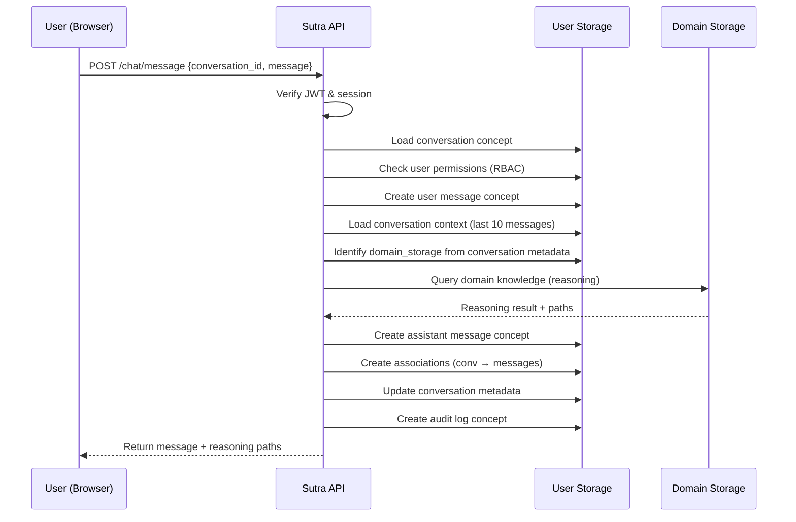

# Conversation-First UI Architecture

**Date:** October 26, 2025  
**Status:** Design Phase  
**Version:** 1.0  

---

## 📋 Executive Summary

This document defines the architecture for Sutra AI's conversation-first user interface, featuring:

- **ChatGPT/Claude-style conversation UI** - Everything organized around chat threads and spaces
- **Dual storage architecture** - Separate storage instances for user management and domain knowledge
- **Zero external dependencies** - No PostgreSQL, Redis, or Elasticsearch (dogfooding `storage.dat`)
- **Multi-tenancy ready** - Organization-based isolation with separate domain storages

**Core Philosophy:** Everything is a conversation. User management, chat history, and permissions are all stored as concepts in Sutra's own storage engine.

---

## 🎯 Design Goals

### Primary Goals

1. **Prove Storage Versatility** - Demonstrate that `storage.dat` can replace classical database stack
2. **Best-in-Class UX** - ChatGPT-level user experience with explainable AI benefits
3. **Complete Dogfooding** - Use Sutra's storage for everything (auth, sessions, conversations)
4. **Multi-Tenancy Foundation** - Architecture supports future multi-organization deployments
5. **Audit Trail Ready** - Every interaction stored as concepts for compliance

### Non-Goals

- Not building a general chat application (domain-specific reasoning only)
- Not replacing Streamlit UI immediately (phased migration)
- Not implementing real-time collaboration (future consideration)

---

## 🗄️ Dual Storage Architecture

### Overview

```
Sutra System
├─ user-storage.dat          ← User management & conversations
│  ├─ Users (replaces PostgreSQL users table)
│  ├─ Sessions (replaces Redis/JWT storage)
│  ├─ Permissions (replaces RBAC tables)
│  ├─ Conversations (chat history)
│  ├─ Spaces (project organization)
│  ├─ Organizations (multi-tenancy)
│  └─ Audit logs (compliance trails)
│
└─ domain-storage.dat        ← Domain knowledge
   ├─ Medical protocols
   ├─ Legal precedents
   ├─ Financial regulations
   └─ User-taught domain concepts
```

### Why Separate Storage Instances?

| Reason | Benefit |
|--------|---------|
| **Independent Scaling** | User data grows linearly with users; domain data grows with knowledge |
| **Separate Backups** | Back up user data (conversations) separately from domain data |
| **Multi-Tenancy Ready** | One user-storage shared, multiple domain-storages per organization |
| **Security Isolation** | Sensitive auth data separated from domain knowledge |
| **Proves Versatility** | Shows storage engine handles both auth and reasoning workloads |

### Storage Deployment

```yaml
# docker-compose configuration

services:
  # User storage (single instance)
  user-storage-server:
    image: sutra-storage-server:${SUTRA_VERSION}
    ports: ["50052:50051"]
    volumes:
      - ./data/user-storage:/data
    environment:
      STORAGE_PATH: /data/user-storage.dat
  
  # Domain storage (multiple possible)
  domain-storage-surgery:
    image: sutra-storage-server:${SUTRA_VERSION}
    ports: ["50053:50051"]
    volumes:
      - ./data/domains/surgery:/data
    environment:
      STORAGE_PATH: /data/domain-storage.dat
  
  domain-storage-cardiology:
    image: sutra-storage-server:${SUTRA_VERSION}
    ports: ["50054:50051"]
    volumes:
      - ./data/domains/cardiology:/data
    environment:
      STORAGE_PATH: /data/domain-storage.dat
```

---

## 📊 Storage Schema Design

### User Storage Concepts (user-storage.dat)

#### 1. User Concept

```python
Concept {
    id: "user_abc123",
    content: "Dr. Sarah Chen - Chief of Surgery at Memorial Hospital",
    semantic_patterns: ["User", "Healthcare", "Administrator"],
    metadata: {
        type: "user",
        email: "sarah.chen@memorial.org",
        email_verified: true,
        password_hash: "$argon2id$v=19$m=65536...",
        role: "admin",  # admin, doctor, researcher, viewer
        organization: "memorial_hospital",
        department: "surgery",
        created_at: "2025-01-15T08:30:00Z",
        last_login: "2025-10-26T09:15:00Z",
        active: true,
        preferences: {
            theme: "dark",
            default_space: "space_surgery_protocols",
            notification_settings: {...}
        }
    },
    confidence: 1.0
}
```

**Replaces:** PostgreSQL users table  
**Query Examples:**
- `semantic_search("user email:sarah.chen@memorial.org")`
- `semantic_search("admin users in surgery department")`
- `graph_query(user_id, "has_session")` - Get active sessions

#### 2. Session Concept

```python
Concept {
    id: "session_xyz789",
    content: "Active session for Dr. Sarah Chen from 192.168.1.50",
    semantic_patterns: ["Session", "Active"],
    metadata: {
        type: "session",
        user_id: "user_abc123",
        token_hash: "sha256_of_jwt_token",
        ip_address: "192.168.1.50",
        user_agent: "Mozilla/5.0...",
        created_at: "2025-10-26T09:15:00Z",
        expires_at: "2025-10-27T09:15:00Z",
        last_activity: "2025-10-26T10:30:00Z",
        active: true
    },
    confidence: 1.0
}
```

**Replaces:** Redis session store  
**Features:**
- JWT token revocation (check session.active before accepting token)
- Session keepalive (update last_activity on each request)
- Multi-device support (multiple sessions per user)
- Durable across restarts (no volatile memory)

#### 3. Conversation Concept

```python
Concept {
    id: "conv_def456",
    content: "Risk assessment discussion for appendectomy procedure",
    semantic_patterns: ["Conversation", "Medical", "RiskAssessment"],
    metadata: {
        type: "conversation",
        user_id: "user_abc123",
        space_id: "space_surgery_protocols",
        organization: "memorial_hospital",
        created_at: "2025-10-26T10:15:00Z",
        updated_at: "2025-10-26T10:30:00Z",
        message_count: 8,
        starred: false,
        shared_with: ["user_ghi789"],
        domain_storage: "domain_memorial_surgery",  # Links to domain storage
        tags: ["risk-assessment", "infection", "temporal-analysis"],
        avg_confidence: 0.91
    },
    confidence: 1.0
}
```

**Replaces:** Conversation database table  
**Semantic Capabilities:**
- Search conversations by topic: `"conversations about infection rates"`
- Find similar conversations: `vector_search(conversation_embedding)`
- Temporal queries: `"conversations from last week about surgery"`

#### 4. Message Concept

```python
# User message
Concept {
    id: "msg_abc123",
    content: "What are the risks of laparoscopic appendectomy?",
    semantic_patterns: ["Question", "Medical"],
    metadata: {
        type: "user_message",
        conversation_id: "conv_xyz789",
        space_id: "space_medical_protocols",
        user_id: "user_abc123",
        timestamp: "2025-10-26T10:15:00Z"
    },
    confidence: 1.0
}

# Assistant message
Concept {
    id: "msg_def456",
    content: "Based on 47 related protocols, infection risk is...",
    semantic_patterns: ["Answer", "Reasoning", "Medical"],
    metadata: {
        type: "assistant_message",
        conversation_id: "conv_xyz789",
        space_id: "space_medical_protocols",
        timestamp: "2025-10-26T10:15:03Z",
        reasoning_path_id: "path_ghi789",
        concepts_used: ["protocol_123", "risk_456", ...],  # 47 concept IDs
        confidence: 0.94,
        domain_storage: "domain_memorial_surgery"
    }
}
```

**Replaces:** Messages table with JSON fields  
**Benefits:**
- Full-text semantic search across all messages
- Query by reasoning confidence
- Find all messages referencing specific domain concepts

#### 5. Space Concept

```python
Concept {
    id: "space_surgery_protocols",
    content: "Surgery Department - Safety Protocols & Risk Assessment",
    semantic_patterns: ["Space", "Medical", "Surgery"],
    metadata: {
        type: "space",
        organization: "memorial_hospital",
        department: "surgery",
        created_by: "user_abc123",
        created_at: "2025-01-15T09:00:00Z",
        conversation_count: 127,
        members: ["user_abc123", "user_def456", "user_ghi789"],
        permissions: {
            "user_abc123": "admin",
            "user_def456": "write",
            "user_ghi789": "read"
        },
        domain_storage: "domain_memorial_surgery",
        icon: "🏥",
        color: "#6366f1"
    }
}
```

**Replaces:** Projects/workspaces table  
**Features:**
- Multi-user collaboration
- Per-space permissions (RBAC)
- Links to specific domain storage

#### 6. Organization Concept

```python
Concept {
    id: "org_memorial",
    content: "Memorial Hospital - Multi-specialty teaching hospital",
    semantic_patterns: ["Organization", "Healthcare"],
    metadata: {
        type: "organization",
        name: "Memorial Hospital",
        domain: "memorial.org",
        subscription_tier: "enterprise",
        max_users: 500,
        max_spaces: 50,
        domain_storages: [
            "domain_memorial_surgery",
            "domain_memorial_cardiology",
            "domain_memorial_emergency"
        ],
        features: ["multi_shard", "audit_logs", "sso"],
        created_at: "2025-01-01T00:00:00Z",
        active: true
    }
}
```

**Replaces:** Organizations/tenants table  
**Multi-Tenancy:** Organization ID used to filter all queries for data isolation

#### 7. Permission Concept

```python
Concept {
    id: "perm_jkl012",
    content: "Dr. Sarah Chen has admin access to Surgery Protocols space",
    semantic_patterns: ["Permission", "Admin"],
    metadata: {
        type: "permission",
        user_id: "user_abc123",
        resource_type: "space",
        resource_id: "space_surgery_protocols",
        role: "admin",  # admin, write, read
        granted_by: "user_xyz000",
        granted_at: "2025-01-15T09:00:00Z"
    }
}
```

**Replaces:** Permission/ACL tables  
**RBAC:** Graph-based permission checks via associations

#### 8. Audit Log Concept

```python
Concept {
    id: "audit_mno345",
    content: "Dr. Sarah Chen queried medical protocols for appendectomy risks",
    semantic_patterns: ["AuditLog", "Query", "Medical"],
    metadata: {
        type: "audit_log",
        user_id: "user_abc123",
        action: "chat_message",
        conversation_id: "conv_def456",
        domain_storage: "domain_memorial_surgery",
        concepts_accessed: ["protocol_123", "risk_456", ...],
        ip_address: "192.168.1.50",
        timestamp: "2025-10-26T10:15:03Z",
        compliance_tags: ["HIPAA", "audit_trail"]
    }
}
```

**Replaces:** Audit log tables  
**Compliance:** Semantic search over audit logs ("Who accessed patient protocol X?")

### Associations (Replaces JOIN tables)

```python
# User → Sessions
Association(user_abc123 → session_xyz789, type="has_session")

# User → Conversations
Association(user_abc123 → conv_def456, type="owns_conversation")

# Conversation → Messages
Association(conv_def456 → msg_abc123, type="contains_message")
Association(conv_def456 → msg_def456, type="contains_message")

# Space → Conversations
Association(space_surgery → conv_def456, type="contains_conversation")

# User → Permissions
Association(user_abc123 → space_surgery, type="has_permission", 
           metadata={role: "admin"})

# Organization → Users
Association(org_memorial → user_abc123, type="has_member")

# Message → Domain Concepts (cross-storage reference via metadata)
msg_def456.metadata.concepts_used = ["protocol_123", ...]
```

---

## 🎨 UI Architecture

### Overview

```
┌─────────────────────────────────────────────────────┐
│                   React Application                  │
├─────────────────────────────────────────────────────┤
│  ┌─────────────┐  ┌──────────────────────────────┐ │
│  │             │  │                              │ │
│  │  Sidebar    │  │     Main Content Area        │ │
│  │             │  │                              │ │
│  │  - Spaces   │  │  - Chat Interface            │ │
│  │  - History  │  │  - Graph Explorer            │ │
│  │  - Search   │  │  - Knowledge Browser         │ │
│  │  - System   │  │  - Dashboard                 │ │
│  │             │  │  - Settings                  │ │
│  │             │  │                              │ │
│  └─────────────┘  └──────────────────────────────┘ │
└─────────────────────────────────────────────────────┘
           │                        │
           ▼                        ▼
    ┌─────────────┐         ┌──────────────┐
    │  Sutra API  │         │  Sutra API   │
    │  (FastAPI)  │         │  (FastAPI)   │
    └─────────────┘         └──────────────┘
           │                        │
           ▼                        ▼
  ┌──────────────────┐    ┌──────────────────┐
  │ User Storage     │    │ Domain Storage   │
  │ (user-storage    │    │ (domain-storage  │
  │  .dat)           │    │  .dat)           │
  └──────────────────┘    └──────────────────┘
```

### Left Sidebar Structure

```
🧠 Sutra AI         [≡] [+ New]
────────────────────────────────
🏠 SPACES
├─ 🏥 Medical Protocols (47)
├─ ⚖️  Legal Research (23)
└─ ➕ New Space...

💬 TODAY
├─ Risk assessment for...
└─ Protocol comparison...

📅 YESTERDAY
└─ Safety procedure review

📆 LAST 7 DAYS
└─ Compliance audit...

🔍 Search conversations...
────────────────────────────────
📚 KNOWLEDGE BASE
├─ 📊 125,847 concepts
├─ 🌐 Graph Explorer
└─ ➕ Add Knowledge

⚙️  SYSTEM
├─ 📊 Dashboard
├─ 🏥 Health
└─ ⚙️  Settings
```

### Main Content: Chat Interface

**Key Features:**
- Progressive streaming with confidence-based refinement
- Inline reasoning path visualization
- Expandable source citations
- Graph visualization toggle
- Export conversation as markdown
- Inline knowledge management (teach Sutra mid-chat)

**Message Structure:**
```tsx
<Message>
  <MessageHeader>
    <Avatar /> {/* User or Sutra */}
    <Timestamp />
    <Actions /> {/* Copy, Share, Export */}
  </MessageHeader>
  
  <MessageContent>
    {content}
  </MessageContent>
  
  {/* Assistant messages only */}
  <ReasoningPath>
    <PathVisualization paths={reasoningPaths} />
    <ConfidenceScore score={0.94} />
    <SourceCitations concepts={conceptsUsed} />
  </ReasoningPath>
  
  <MessageActions>
    <Button>👍 Helpful</Button>
    <Button>👎 Not helpful</Button>
    <Button>🔗 Copy</Button>
    <Button>🌐 View Graph</Button>
  </MessageActions>
</Message>
```

---

## 🔐 Authentication Flow

### Login Process

```
1. User enters email/password
2. API queries user-storage.dat:
   - Semantic search for user by email
   - Verify password hash
3. Create session concept in user-storage.dat
4. Create association: user → session
5. Generate JWT with session_id
6. Return token + user info
```

### Request Authentication

```
1. Extract JWT from Authorization header
2. Decode JWT (get user_id, session_id)
3. Query user-storage.dat:
   - Get session concept by session_id
   - Verify session.active = true
   - Verify session not expired
4. Get user concept by user_id
5. Update session.last_activity
6. Proceed with request
```

### Logout (Token Revocation)

```
1. Identify session_id from JWT
2. Update session concept in user-storage.dat:
   - Set active = false
3. Token is now invalid (even if not expired)
```

**No Redis needed!** Sessions are durable concepts in storage.

---

## 💬 Chat Message Flow

### User Sends Message



### Key Points

1. **Permission Check:** Graph query `user → space → conversation`
2. **Context Loading:** Graph traversal `conversation → messages` (last N)
3. **Cross-Storage Link:** Conversation metadata specifies which domain storage to query
4. **Audit Trail:** Every query creates audit log concept

---

## 🔍 Search Capabilities

### 1. Conversation Search (Semantic)

```python
POST /search/conversations
{
    "query": "infection rates",
    "space_id": "space_surgery",  # Optional filter
    "limit": 20
}

# Backend implementation
async def search_conversations(query: str, space_id: str = None):
    # Generate embedding for query
    query_embedding = await embedding_service.generate(query)
    
    # Vector search in user-storage.dat
    # Filter by metadata.type = "user_message" or "assistant_message"
    message_matches = await user_storage.vector_search(
        query_embedding,
        limit=100,
        filters={
            "metadata.type": {"$in": ["user_message", "assistant_message"]},
            "metadata.space_id": space_id if space_id else None
        }
    )
    
    # Group by conversation_id
    conversations = group_by_conversation(message_matches)
    
    return conversations
```

**Results:**
```
💬 Conversations (8)
├─ Risk assessment for... (Today)
│  "...infection rates have decreased to 2.1%..."
│  47 messages • Medical Protocols space
│
└─ Post-op complications review (Yesterday)
   "...temporal analysis of infection trends..."
   23 messages • Medical Protocols space

📚 Knowledge Base (142)
└─ Protocol-2024-Infection-Prevention
   "Standardized infection control measures..."
```

### 2. Global Search (Cross-Storage)

```python
POST /search/global
{
    "query": "appendectomy risks",
    "limit": 50
}

# Searches:
# 1. User storage: conversations, messages
# 2. Domain storage: domain concepts
# Returns unified results
```

### 3. Space Analytics

```python
GET /spaces/{space_id}/analytics

# Aggregates from concepts:
# - Conversation count
# - Message count  
# - Most discussed topics (semantic clustering)
# - Most referenced domain concepts
# - Activity timeline
```

---

## 🏢 Multi-Tenancy Strategy

### Current: Multiple Users, Single System

```
Organization A (Memorial Hospital)
├─ user-storage.dat (shared with all orgs)
│  └─ Users/Conversations filtered by organization="memorial"
└─ Domain storages
   ├─ domain_memorial_surgery.dat
   ├─ domain_memorial_cardiology.dat
   └─ domain_memorial_emergency.dat

Organization B (City Legal Firm)
├─ user-storage.dat (same file)
│  └─ Users/Conversations filtered by organization="city_legal"
└─ Domain storages
   ├─ domain_citylegal_cases.dat
   ├─ domain_citylegal_contracts.dat
   └─ domain_citylegal_precedents.dat
```

**Data Isolation:**
- All queries filtered by `metadata.organization`
- Graph traversal never crosses organization boundaries
- Separate domain storages per organization
- API enforces tenant isolation at query level

### Future: Full Multi-Tenancy (One Instance, Many Organizations)

**Option 1: Shared User Storage (Current)**
- Single `user-storage.dat`
- Organization-based filtering on all queries
- Pros: Simple deployment, lower resource usage
- Cons: Relies on query filtering for isolation

**Option 2: Separate User Storage Per Organization**
- `user-storage-memorial.dat`
- `user-storage-citylegal.dat`
- Pros: Complete data isolation, easier backups per tenant
- Cons: More storage instances to manage

**Recommendation:** Start with Option 1, migrate to Option 2 for enterprise customers requiring strict isolation.

---

## 🚀 API Design

### Authentication Endpoints

```python
POST   /auth/register
POST   /auth/login
POST   /auth/logout
POST   /auth/refresh
GET    /auth/me
POST   /auth/verify-email
POST   /auth/reset-password
```

### Conversation Endpoints

```python
POST   /conversations/create          # Create conversation concept
GET    /conversations/list            # Query conversation concepts
GET    /conversations/{id}            # Get conversation details
GET    /conversations/{id}/messages   # Graph traversal: conv → messages
POST   /conversations/{id}/message    # Send message (main chat endpoint)
PATCH  /conversations/{id}            # Update metadata (star, tags)
DELETE /conversations/{id}            # Soft delete
POST   /conversations/{id}/share      # Add user to shared_with
GET    /conversations/{id}/export     # Export as markdown
```

### Space Endpoints

```python
POST   /spaces/create                 # Create space concept
GET    /spaces/list                   # Query space concepts
GET    /spaces/{id}                   # Get space details
GET    /spaces/{id}/conversations     # Graph traversal
GET    /spaces/{id}/analytics         # Aggregate stats
PATCH  /spaces/{id}                   # Update metadata
POST   /spaces/{id}/members           # Add/remove members
PATCH  /spaces/{id}/permissions       # Update RBAC
```

### Search Endpoints

```python
POST   /search/conversations          # Semantic search over messages
POST   /search/global                 # Search both storages
POST   /search/space/{id}             # Scoped search
GET    /search/recent                 # Recent searches (user history)
```

### User Endpoints

```python
GET    /users/me                      # Current user profile
PATCH  /users/me                      # Update preferences
GET    /users/me/sessions             # List active sessions
DELETE /users/sessions/{id}           # Revoke session
GET    /users/me/activity             # Activity history
```

### Knowledge Endpoints

```python
POST   /knowledge/learn               # Teach new concept (inline)
POST   /knowledge/bulk                # Bulk ingestion
GET    /knowledge/stats               # Domain storage stats
GET    /knowledge/concepts/{id}       # Get concept details
POST   /knowledge/graph               # Graph queries
```

### System Endpoints

```python
GET    /system/health                 # All services
GET    /system/stats                  # Usage statistics
GET    /system/audit                  # Audit log query
GET    /system/organizations          # List orgs (admin only)
```

---

## 📊 Performance Considerations

### User Storage Performance

| Operation | Latency | Notes |
|-----------|---------|-------|
| Login (query + session create) | ~10ms | Semantic search + 2 concept writes |
| Token verification | ~3ms | Get concept by ID + metadata check |
| Load conversation (50 messages) | ~15ms | Graph traversal + parallel fetches |
| Create message | ~5ms | Create concept + association |
| Semantic search (10K conversations) | ~50ms | Vector search + grouping |
| Space analytics | ~20ms | Aggregate queries |

### Optimization Strategies

1. **Caching:** Cache frequently accessed concepts (users, spaces) in memory
2. **Indexing:** Ensure metadata fields are indexed (type, organization, user_id)
3. **Batch Operations:** Use batch concept creation for bulk operations
4. **Connection Pooling:** Maintain persistent gRPC connections
5. **Lazy Loading:** Paginate message history (load on scroll)

---

## 🎯 What We're Proving

### Storage Engine Replaces Classical Database Stack

| Classical System | Sutra Storage | Advantage |
|-----------------|---------------|-----------|
| PostgreSQL users | User concepts | Semantic search by name/role/dept |
| Redis sessions | Session concepts | Durable, queryable, audit trail |
| PostgreSQL permissions | Permission concepts + associations | Graph-based RBAC |
| PostgreSQL conversations | Conversation concepts | Semantic search across history |
| JOIN tables | Associations | Native graph queries |
| Elasticsearch | Semantic search | Meaning-based, not keywords |
| Audit log tables | Audit log concepts | Query with natural language |

### Benefits

✅ **70% Infrastructure Reduction** - One system instead of 4+  
✅ **Semantic Capabilities** - Search everything by meaning  
✅ **Complete Audit Trail** - Every action is a queryable concept  
✅ **Dogfooding** - Proves our storage engine's versatility  
✅ **Multi-Tenancy Ready** - Organization-based isolation built-in  
✅ **Cost Effective** - Single storage format, lower ops overhead  

---

## 🔮 Future Enhancements

### Phase 2 (Future)

- **Real-time Collaboration:** Multiple users in same conversation
- **Voice Input:** Speech-to-text for queries
- **Mobile Apps:** React Native for iOS/Android
- **Offline Mode:** Local storage sync
- **Advanced Analytics:** Usage patterns, popular topics
- **Custom Workflows:** Automated reasoning pipelines

### Phase 3 (Future)

- **SSO Integration:** SAML/OAuth for enterprise
- **Advanced RBAC:** Fine-grained permissions
- **Data Export:** GDPR compliance tools
- **Custom Themes:** White-label branding
- **API Rate Limiting:** Per-user quotas
- **Webhook Integrations:** External system notifications

---

## 📚 Related Documentation

- **[IMPLEMENTATION_ROADMAP.md](./IMPLEMENTATION_ROADMAP.md)** - Step-by-step implementation plan
- **[TODO.md](./TODO.md)** - Detailed task checklist
- **[STORAGE_ARCHITECTURE_DEEP_DIVE.md](../STORAGE_ARCHITECTURE_DEEP_DIVE.md)** - Storage engine details
- **[SYSTEM_OVERVIEW.md](../SYSTEM_OVERVIEW.md)** - Overall system architecture
- **[MULTI_TENANCY_ARCHITECTURE.md](../MULTI_TENANCY_ARCHITECTURE.md)** - Multi-tenant design

---

## 🤝 Contributors

This design represents a fundamental shift in how Sutra AI presents itself to users and proves the versatility of our storage engine. All contributions should align with the conversation-first, dogfooding philosophy outlined here.

---

**Status:** Ready for implementation  
**Next Steps:** See [IMPLEMENTATION_ROADMAP.md](./IMPLEMENTATION_ROADMAP.md)
